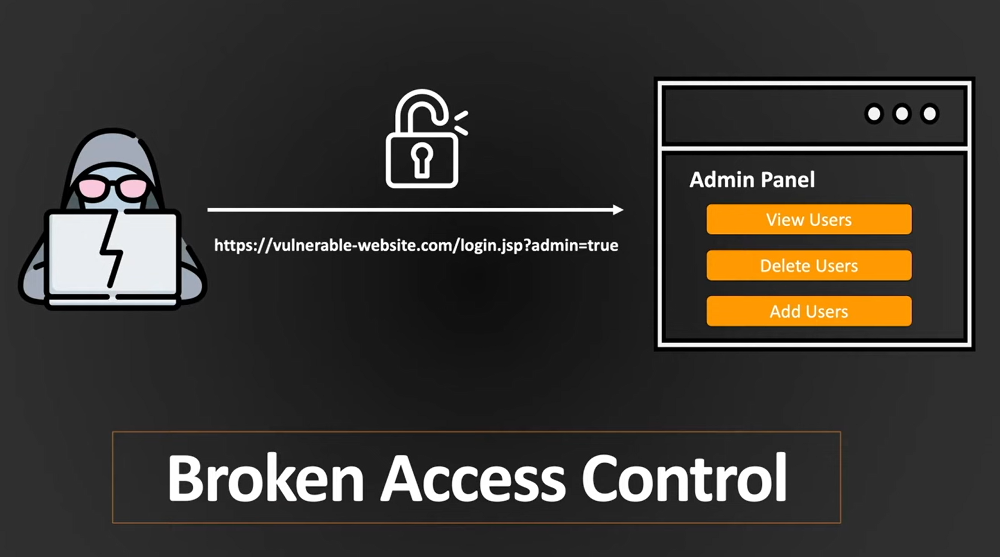
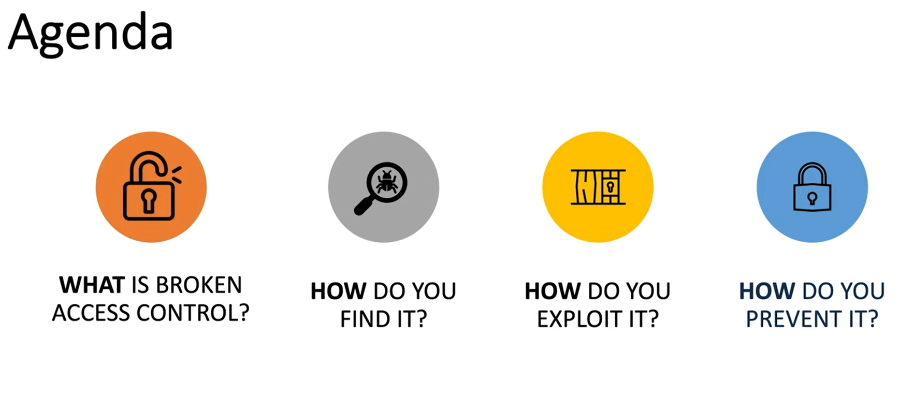
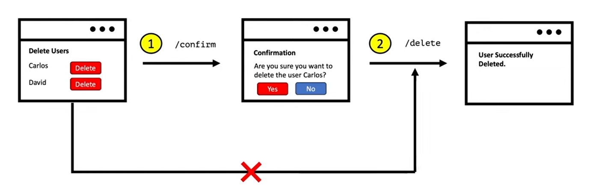

# Broken access control theory

## What is broken access control ? 
- This is one of the most common vulnerabilities.
- Prerequisite mechanisms that we need understand before we start: 
  1. Authentication: It is the mechanism to identify the user and confirm that they are who they say to be. 
     - Login, 2FA, Biometrics, etc...
  2. Session management: It is a mechanism of identifing which subsequent HTTP requests are being made by which user
     - Cookies, and tokens.
     - If you are not authenticated, you may be prevented from visiting certain pages.
     - It is usually used to enhance UX, instead of inserting the username and password for visiting each page, you just authenticate yourself once, and later the browser should handle these tokens. 
     - That is why, it is usually very important to avoid session token leakage, because sometimes if the user got access to these tokens, then he can access the system and masqurade another users. 
  3. Access control: it is a mechanism that determines the user is allowed to carry out the action that they attempt to perform
       - It is the Authorization :)
       - The session token is passed to the backend, and the backend should check what are the functionalities that this user is authorized to perform.

## Types of access control
1. Vertical access control:
   - It is used to restrict access to functions not available for other users in the organization
     - Admin user can perform actions which the normal user shouldn't use. 
2. Horizontal access control
   - It is used to restrict different users of same perivilages to access each other resources.
   - Like file management system, where each user should not be able to see other users files. 
3. Context-Dependent access control
   - Restrict access to functionality and resources based on the state of the application or the user's interaction with it. 
     - Imaging having multistage process to delete a user
     - So the main idea of this approach is to prevent user from performing actions in wrong order
     - So imagine that you have a button to delete a user, and then on pressing on it, you get a shown alert asking if you are sure that you want to delete this user, and if yes you call the delete endpoint. 
       -       
     - So this should prevent you from deleting user by mistake. 
## Broken access control vulnerabilities
- They araise when users can act outside of their intended permissions. This is typically leads to sensitive information disclousre, unauthorized access and modification or destruction of data. 
-  