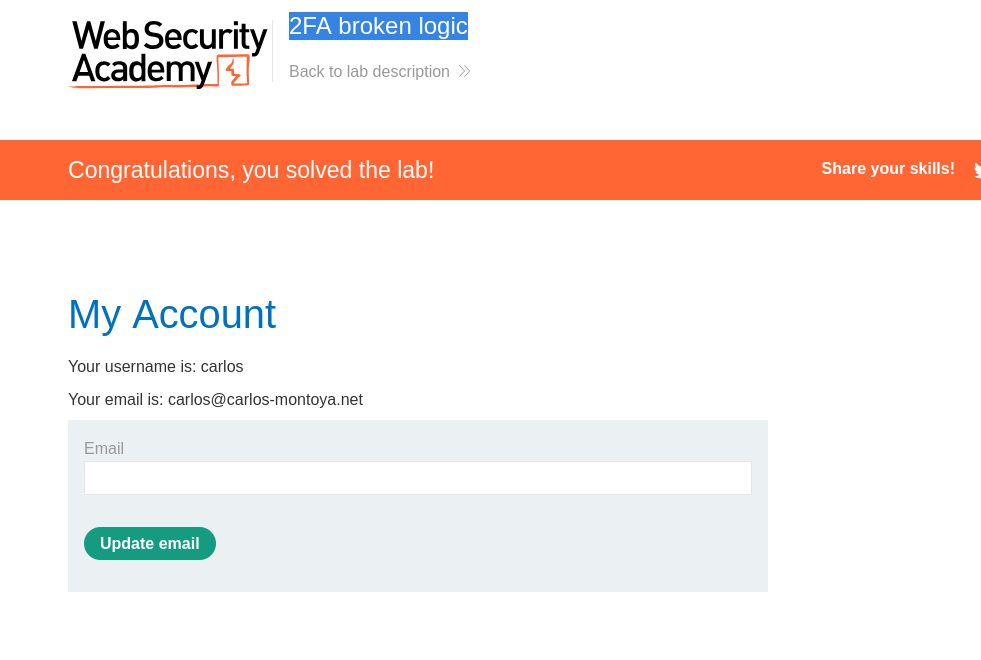

# 2FA broken logic

## Analysis steps
1. Open the login page
2. Use burp to intercept the request
3. login with werner credentials
   1. You will notice 2 requests
      1. POST to send the login form
      2. GET to get the 2FA page with the verifier name as **wiener** <-
4. open the email service and get the user otp and add it to login as wiener. 
   
## Exploit steps
1. insert wiener credentials
2. intercept the GET request, and change the verify parameter to **carlos**
3. send the 2FA request to the intruder
4. perform sniper attack and mark the mfa-code with target, and choose numbers, and set the minimum digits to 4
5. Go to the settings and allow the redirection
6. run the attack, and get the request with the highest number of redirections
7. get the code
8. go the intercepted request in the proxy and change the 2fa code to the retrieved code