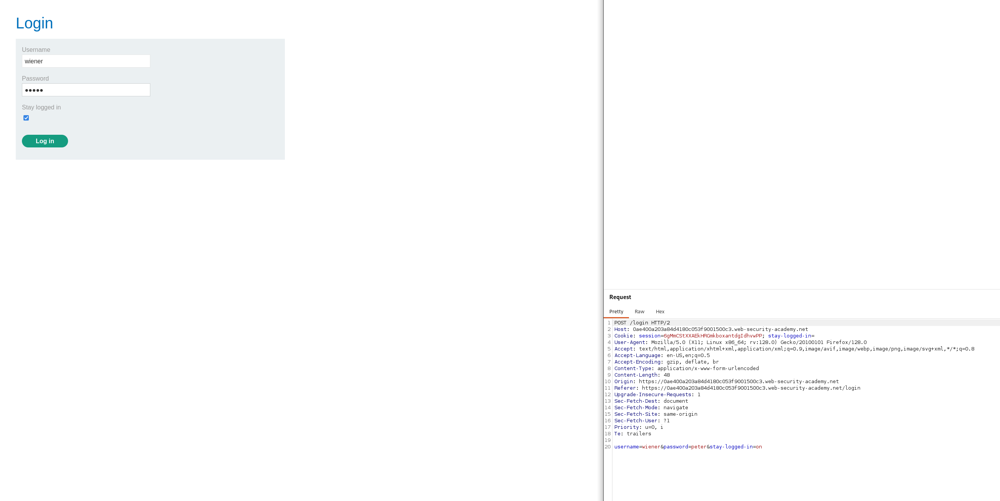
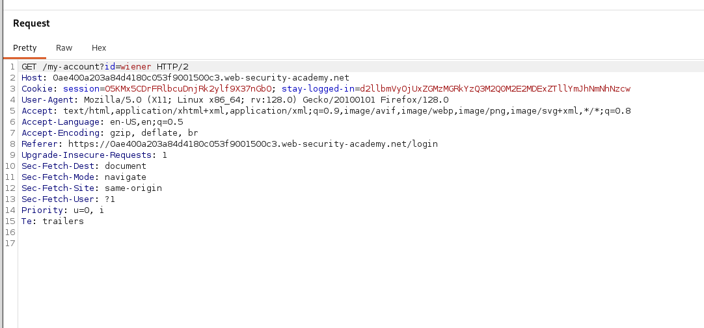
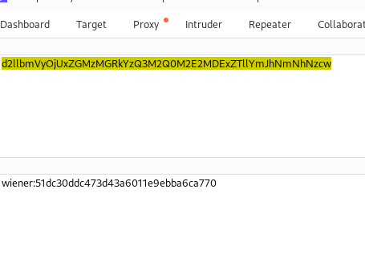
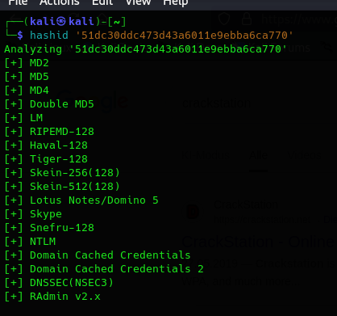
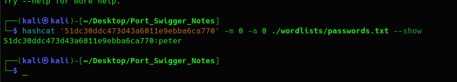
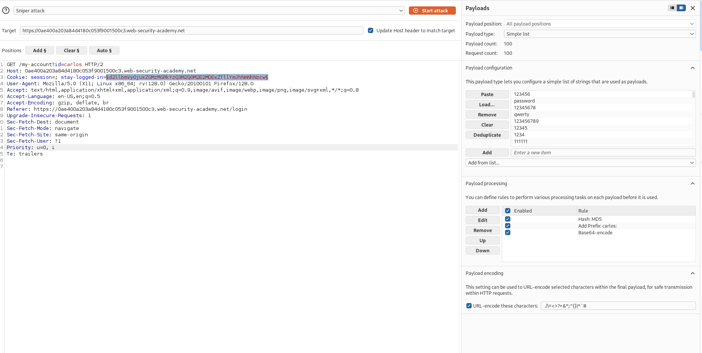

# Brute-forcing a stay-logged-in cookie
- First we need to perform the normal task by logining in and see what happens:
  - 
- So we can see that there is a cookie for the session, and another cookie for the stay-logged-in, which is empty for now
- Once we forward the request with the correct credentials, we can see that the stay-logged-in cookie is now filled with a value that allows us to stay in even when we close the website:
  - 
- Now we should perform some analysis on this cookie: 
  - On trying to decode the token as base64 using the Decoder tab we can see that it consists of username:md5(password)
    - 
    - 
    - 
    - So by using hashcat we can see that the given hash is actually the md5hash of the password
  - So we can conclude that this is the attack that we should do:
    - bruteforce for x in given dictionary
      - base64(carlos:md5hash(x))
- So we need to capture the GET myaccount request which includes the stay-logged-in cookie, and remove the session cookie, because the stay-logged-in will automatically generate a session cookie for us 
- Then we load the password list in our payload
- Then we need to perform 3 payload processing:
  1. Hash MD5 for each payload
  2. prefix with carlos:
  3. Base64 encoding for the result
     -  
- Run the attack, and check for the response with 200, and then you will get the lab solved :). 
- 