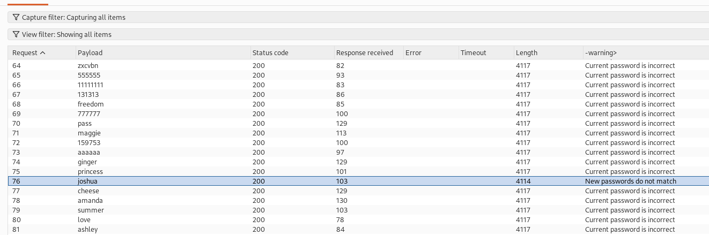

# Password brute-force via password change
- The idea is that the change password functionality is not tied to the session token, and also we have different responses when using different passwords
- Based on this we can know what is the password of the carlos user. 

## Steps: 
1. Login with Wiener credentials.
2. Try different cases with the change password. (via repeater)
   1. Try correct current password, and same new password and confirm new password
   2. Try wrong current password, and same new password and confirm new password
   3. Try correct current password, and different new password and confirm new password
3. You will notice that if the current password is correct and the two passwords matches, then you will go to a page which confirm the password change. 
4. If the current password is not correct and you have the same new password and confirm password, the account it locked out and you go to the login page. 
5. if the current password is not correct and the two passwords does not match, then you have the error message: **Current password is incorrect** 
6. If the current password is not correct and you have the different new password and confirm password, the error message is **New Passwords Does Not Match**
7. So we will make advantage of this, we will send the change password request to the intruder, and go to grep extract, and mark the warning to display this message, and add two different new passwords, and the username is carlos, and we mark the current password, and load the given dictionary for the payload. 
8. Then we run the attack, and we wait until we see **"New Passwords Does Not Match"**, this imply that the used password was correct, then we will take it to login as carlos
   1. 
9. Now the lab is solved :)
   -   