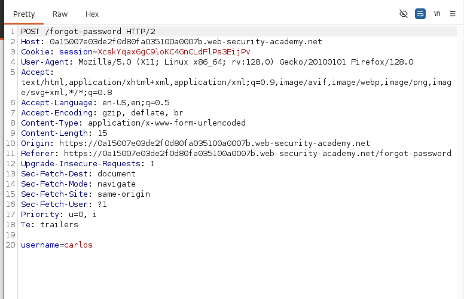
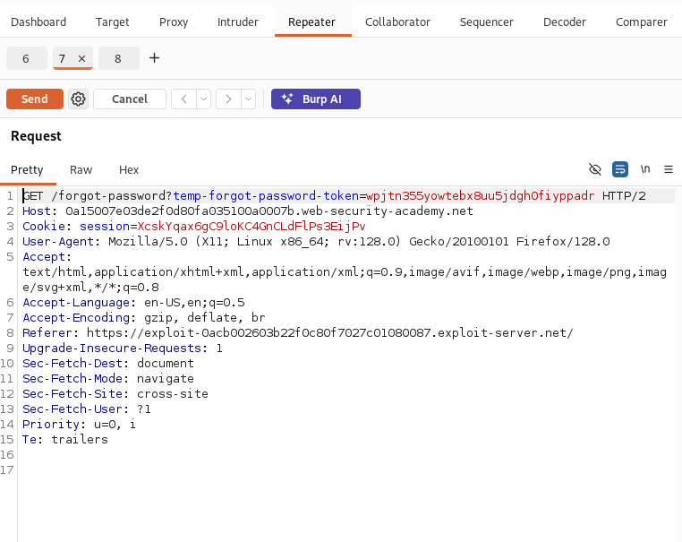
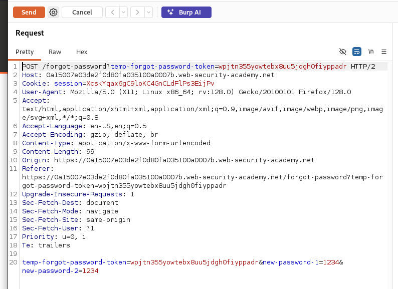
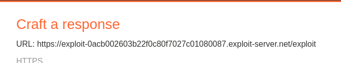
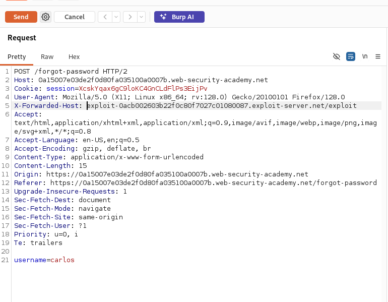
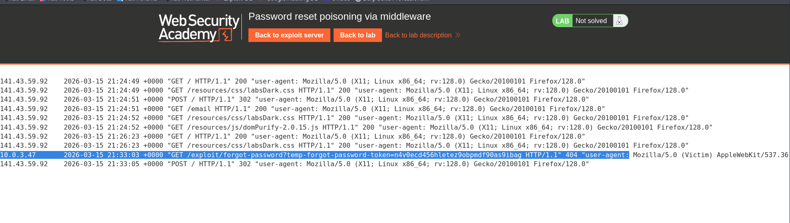
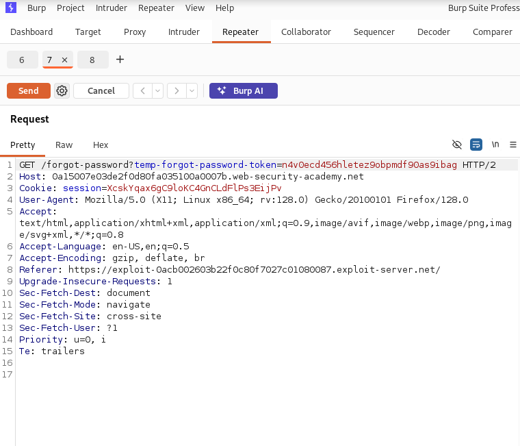
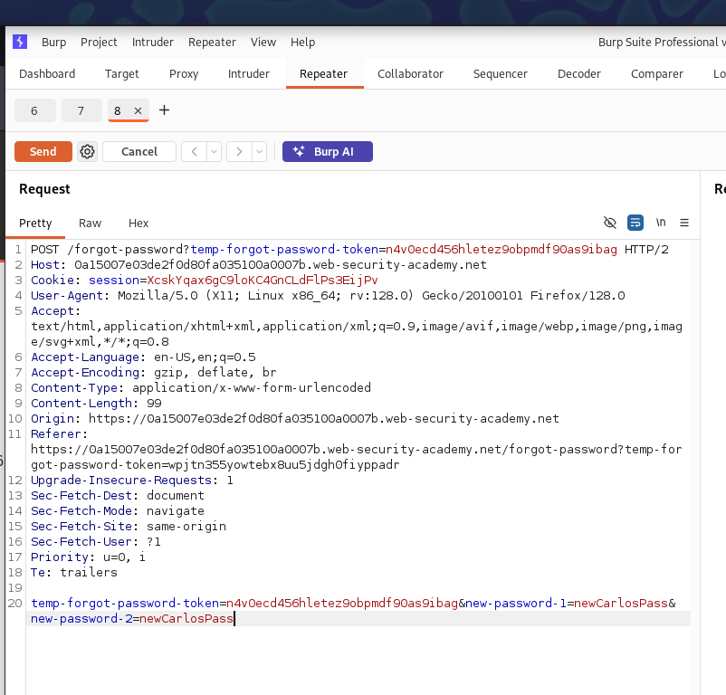

# Password reset poisoning via middleware
- The main goal of this part is to exploit the vulnerability in forget password page. 
- The idea is to send carlos a link, which when he clicks, it will send the forget  password token to you instead of sending it to the server. 
- And we can do this by exploiting the X-Forwarded-Header which tells the server which URL to send the response to. 
- So we will add our server instead of the normal server, then we use this token to reset carlos password and log in with his account. 

## Steps: 
1. Open The Forget password page, and open burp to intercept requests.
2. Enter wiener username and press submit, and capture this POST request and send it to the repeater
   - 
3. Then go to exploit server, and go to email client, then click on the provided link, and also capture this request, and send it to the repeater. 
   - 
4. Insert the new password and confirm password, and capture this request and send it to the repeater also. 
   -  
5. Now notice the  forget-password-token, our main goal now is to retrieve this token from carlos, so what we will do is that in the first request we will add the header: 
   - X-Forwarded-Host=Our server URL which we can get from the exploit server:
     - 
     - 
   - Now we send this request, and go to the server logs, and see if we will get the cookie. 
     - 
   - Now we use this Cookie to send the reset request, and see if it will work
     - 
     - 
   - Now we need to try to login with Carlos new pass
     - 