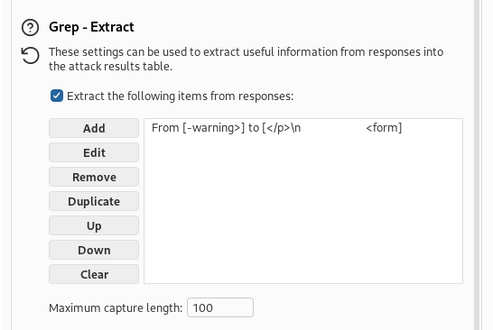

# Username enumeration via subtly different responses - Solution
- There are two ways to solve this task. 
- First and naive task, is to perform brute-force on the given lists.
1. Open burpsuite
2. Catch the request via proxy. 
3. send it to the intruder. 
4. select cluster bomb attack. 
5. in the username, add its possible words. 
6. in the password, add its possible words.
7. run the attack, and sort them based on the response length, and select the one with obvious different length. 

- Second way is to notice the difference in the error message. 
1. Open burpsuite
2. Catch the request via proxy. 
3. send it to the intruder. 
4. select sniper attack. 
5. add username wordlist. 
6. go to settings
7. go to grep extract
8. press add
9. press fetch request
10. hover with mouse over the Invalid username and password.
11. press ok
12. run the attack 
13. sort the warning messages
14. 
15. notice that affile user warning message does not have **.** at the end of the warning message, which indicate that it is different from other users. 
16. now run the sniper attack on the password to get **batman**, and login with these credentials. 