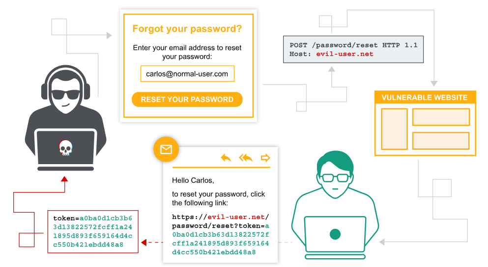
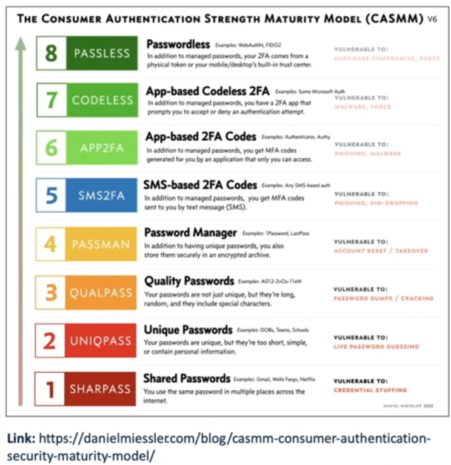
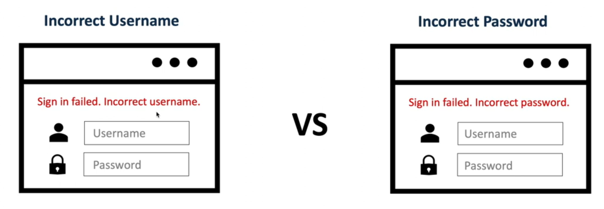
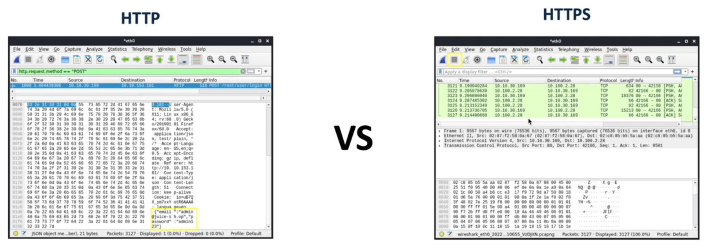
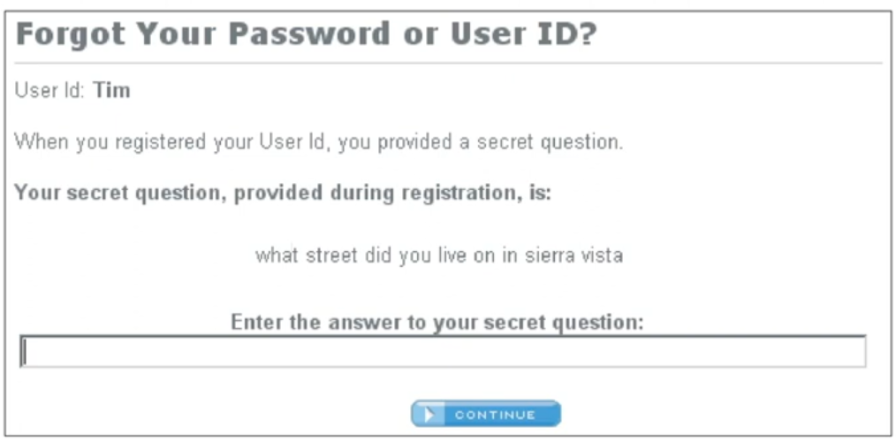
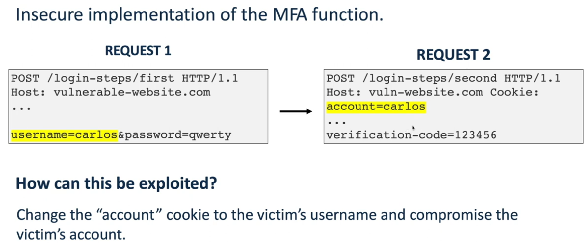
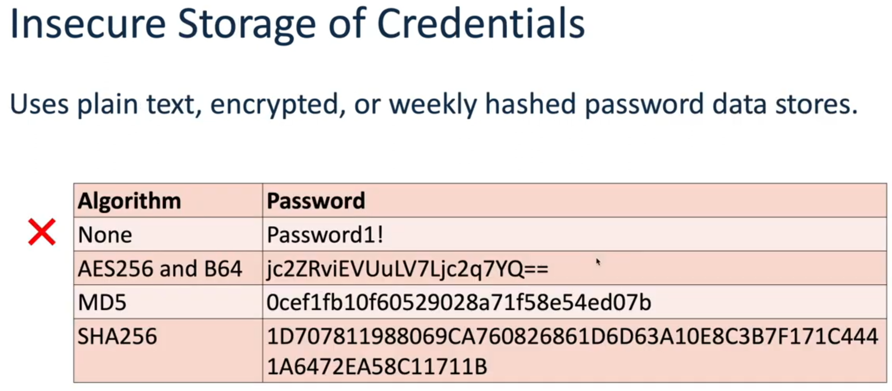
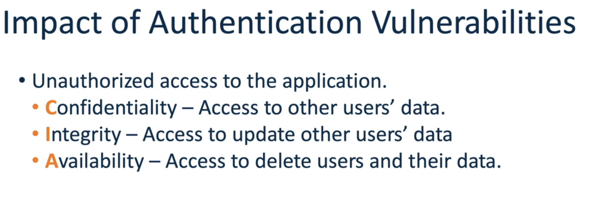
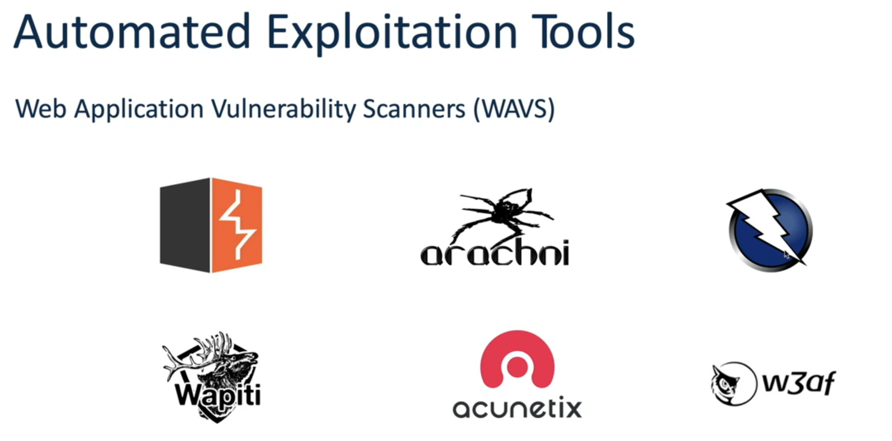

# Authentication_Vulnerability

## What are Authentication flaws? 
- Authentication is to identify the user and confirm that they are who they pretend to be. 
- To perform that, usually we use some of these methods:
  - HTML form-based authenticator.
  - Multi-factor mechanisms
  - Kerberos or NTLM on windows.
  - etc..

### Authentication vulnerabilities
- They arise from insecure implementation of the authentication mechanisms in an application. 
- We will discuss here the most common root causes of this vulnerability. 

1. Weak password requirements
   - Having no or minimal controls over the quality of user's passwords
     - Very short or blank
     - common dictionary words or names
     - Password is the same as the username
     - Use of default password
     - Missing or ineffective MFA
   -  
      -  as you go down you are more worse.
2. Improper restriction of authentication attempts
   - Application permits brute force or other automated attacks
   - This may happens in the following pages:
     - Login page
     - OTP / MFA page
     - Change password page   
3. Verbose error message
   - The application outputs a verbose error message that allows for username or password enumeration
     -  
   - We should also check if there is a difference in the error messages, for example: 
     - for valid username we get: 
       - Incorrect username or password
     - for invalid username we get:
       - Incorrect username or password. <- notice the dot 
       
4. Vulnerable transmission of credentials
   - Like when the application uses unencrypted HTTP connection to transmit login credentials
     -   
5. Insecure forgort password functionality
   - design weaknesses in the forgotten password functionality usually make the weakest link that can be used to attack the application's overall authentication logic
     - 
6. insecure implementation of the MFA function
   - 
   - The problem here is that the verification-code is not binded to the username. 
   - So attacker can request a verification code using his credentials, and then change the cookie value to the victim account name, and most probably he will get the login to the victim account.  
7. Insecure storage of credentials
   - 
   - We should store the hash value of the passwords not the password themselves. 
   - We should not use encryption either, because the only one who should be supposed to know his password is the user, not the server. 

- When it comes to the authentication, we do not only test for login pages, but for all pages related to the authentication 

### Impact of Authentication vulnerabilities.

- Worst case is to combine it with another vulnerability to get remote access code execution. 

## How do we find and exploit them? 
- Review the website for any description of the rules for the password
- If self registration is possible, attempt to register several accounts with different kinds of weak passwords to discover what rules are in place
  - Very short or blank
  - Common dictionary words
  - Same pass as username. 
- if you control a single account and password, change is possible, attempt to change the password to various week values.

### Improper restriction of authentication attempts
- manually submit several bad login attempts for an account we control.
- if after several attempts the application does not return a message about account lockout, attempt to log in correctly, if it works, then there is no lockout mechanism.
- in that case, we know that we can brute-force the page. 
- in case that there is a locked out, we monitor the requests and responses to determine if the lockout mechanism is insecure, we can find the cookies and check if we can exploit it.
- Apply this test on all authentication pages not only on login page
### Verbose Error Message
- Submit a request with a valid username and invalid password
- invalid username and valid password
- review both responses for any differences in the status code, any redirects, information displayed on the screen, HTML page source, or even the time to process the request. 
- if there is a difference in the response, we can run a brute-force attack to enumerate the list of valid usernames in the application.

### Vulnerable transmission of credential
- Perform a successful login while monitoring all traffic in both directions between the client and the server.
- Look for instances where credentials are submitted in a URL query string, or as a cookie, or are transmitted back from the server to the client.
- Attempt to access the appliaction over HTTP and if ther are any redirections to HTTPs.

### Insecure Forgot password 
- Identify if the application has any forgotten password functionality 
- if it does, perform a complete walk-through of the forget password functionality using an account that we control of while intercepting the requests / responses in a proxy. 
- review the functionality to determine if it allows for username enumeration or brute-force attacks. 
- if the application generate an email containing a recovery URL, obtain a number of these URLs, and attempt to identify any predictable patterns or sensitive information included in the URL. Also check if the URL is long lived and doesn't expire. 
### Defects in Multistage login mechanism
- Identify if the application uses a multi-stage login mechanism
- If it does, perform a complete walk-through using an account that we have control of, while intercepting the requests and responses in proxy. 
- Review the functionalities to determine if it allows for username enumeration or brute-force attacks. 

### Insecure storage of credentials.
- Review all the application's authentication related functionalities. if we find any instances where the users's password is transmitted to the client as plaintext or obfuscated, this indicates that the passwords are being stored insecurely.
- If we gain remote code execution on the server, review the database to determine if the passwords are stored insecurly. 

## Automated Exploitation tools 
- 

## How do we prevent them ? 
- Wherever possible, implement multi-factor authentication.
- Change all default credentials.
- Always use an encrypted channel or HTTPs when sending the user credentials.
- Stored credentials should be hashed and salted using cryptographically secure algorithms
- Use identical, generic error messages on the login form when the user enters incorrect credentials.
- Implement an effective password policy.
- Use a simple password checker to provide real time feedback on the strength of the password. 
- Implement robust brute-force protection on all authentication pages.
- Audit any verification or validation logic throughly to eliminate flaws.
- 