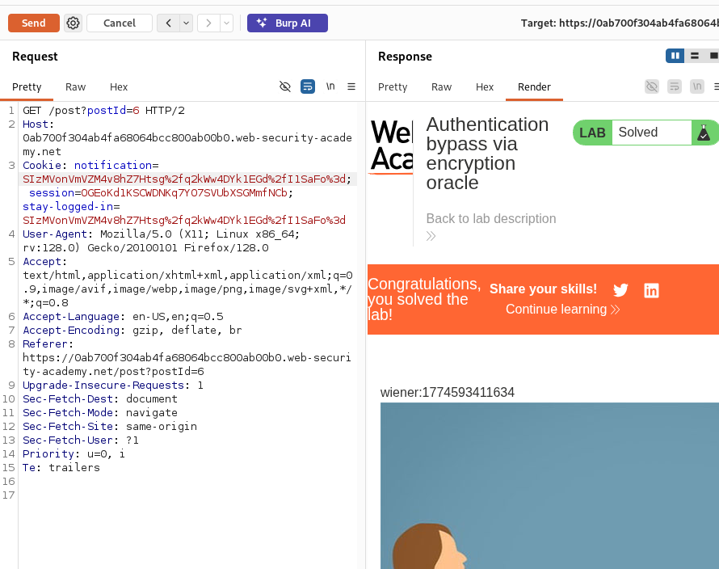
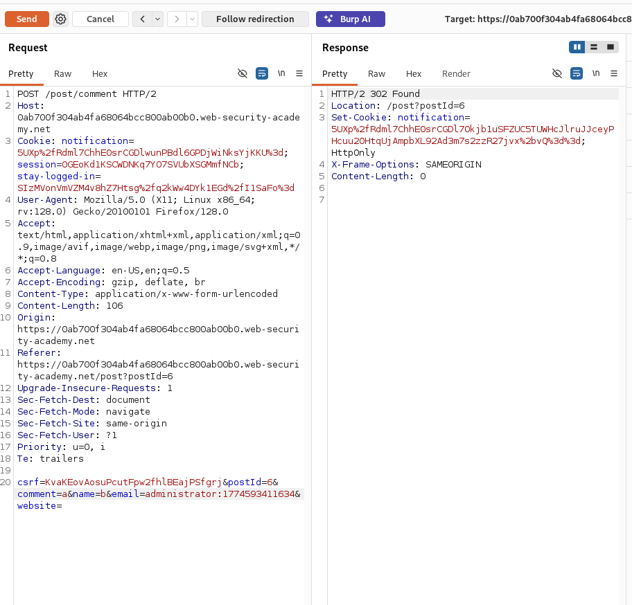
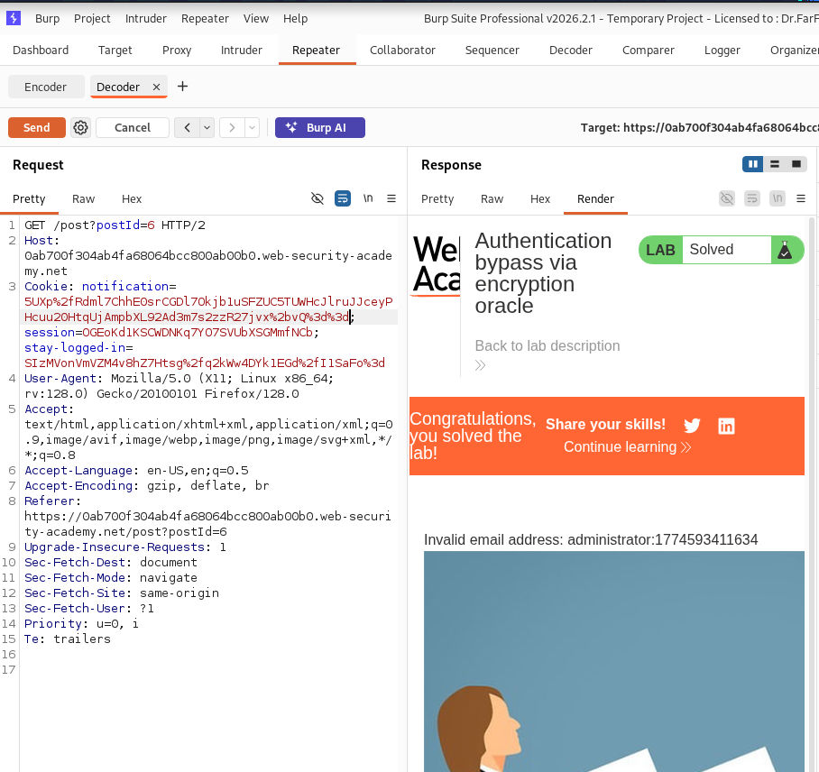
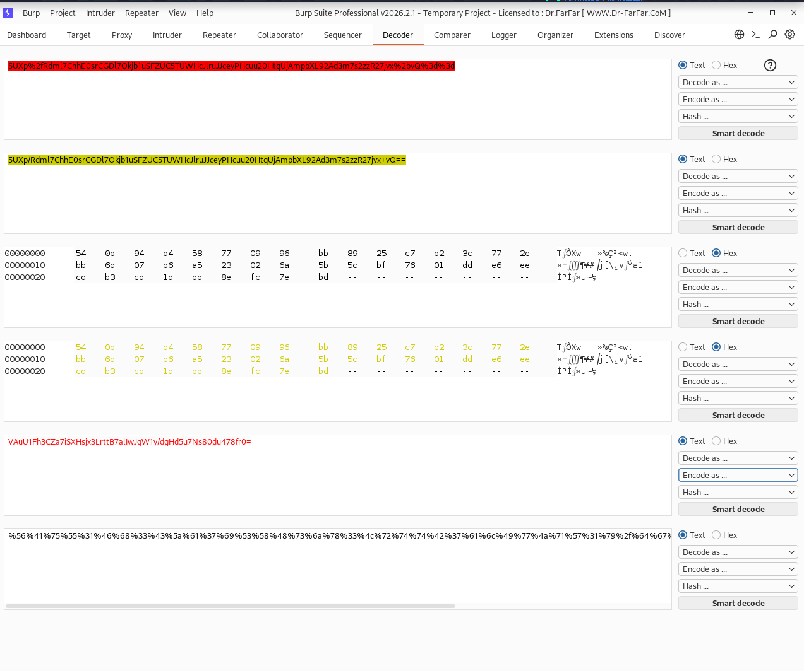
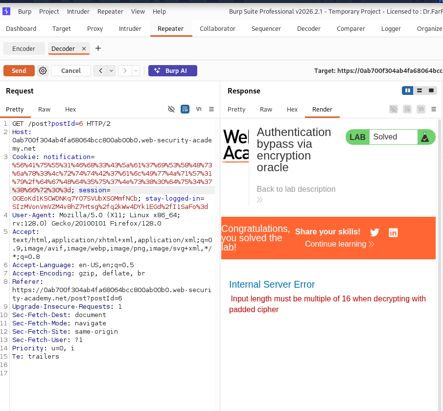
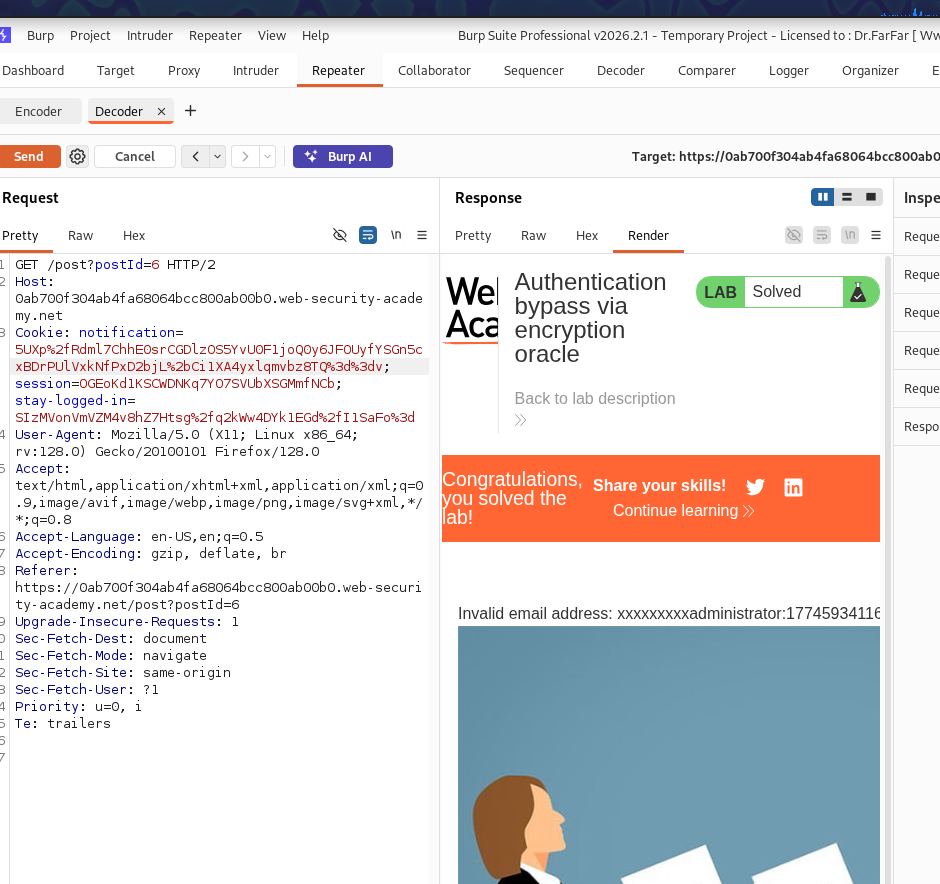
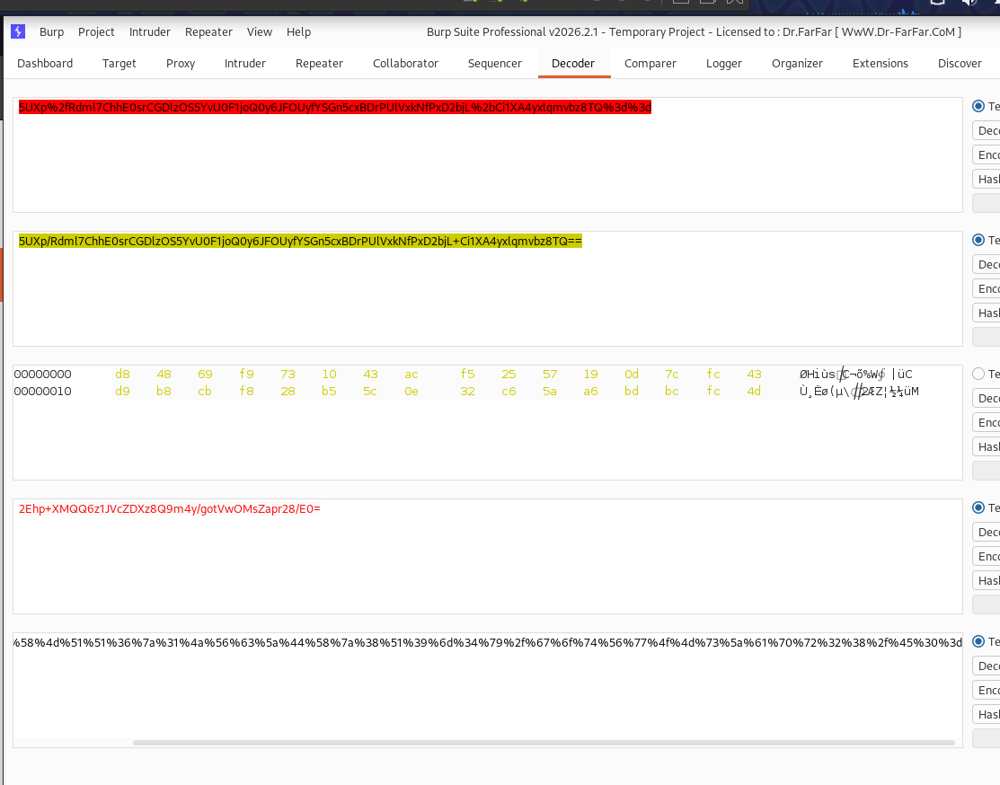
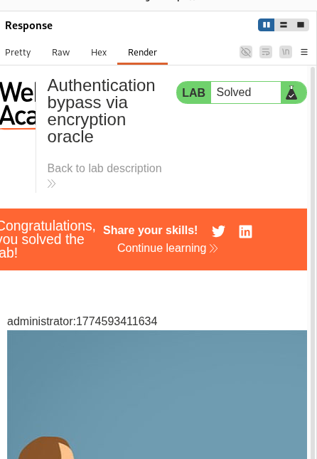
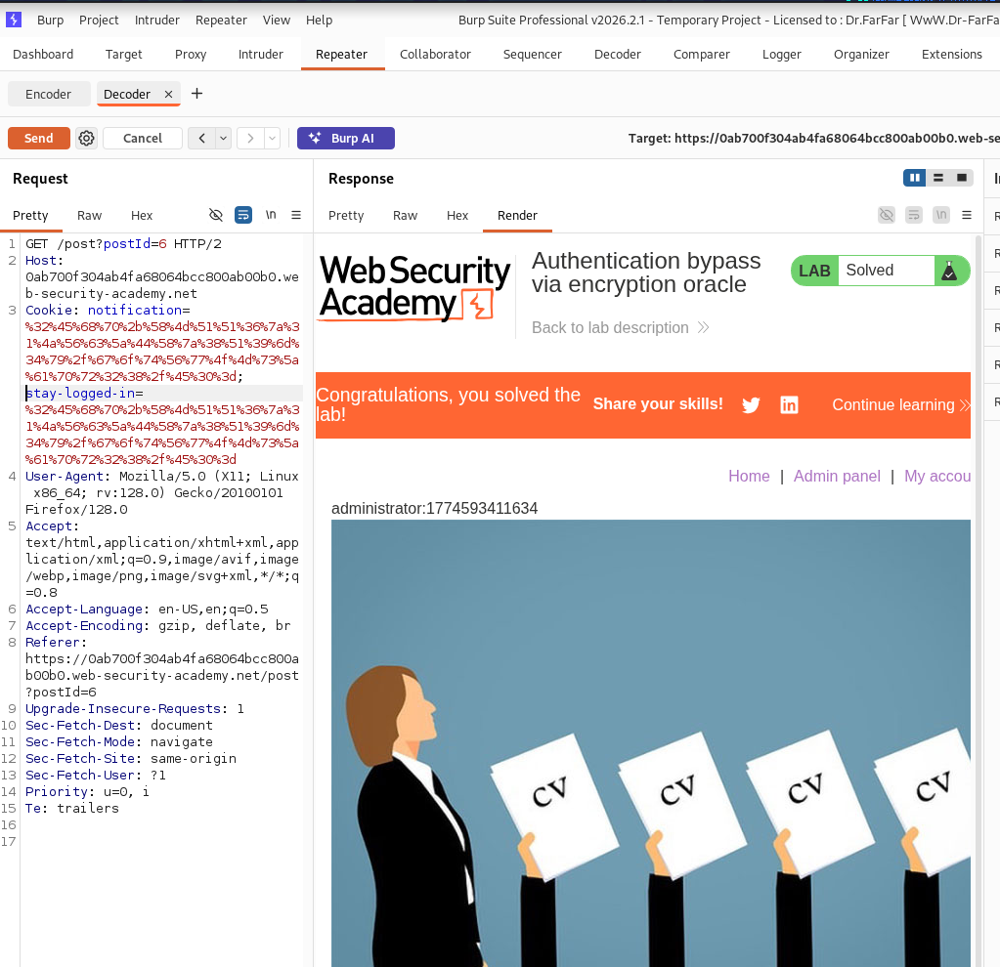
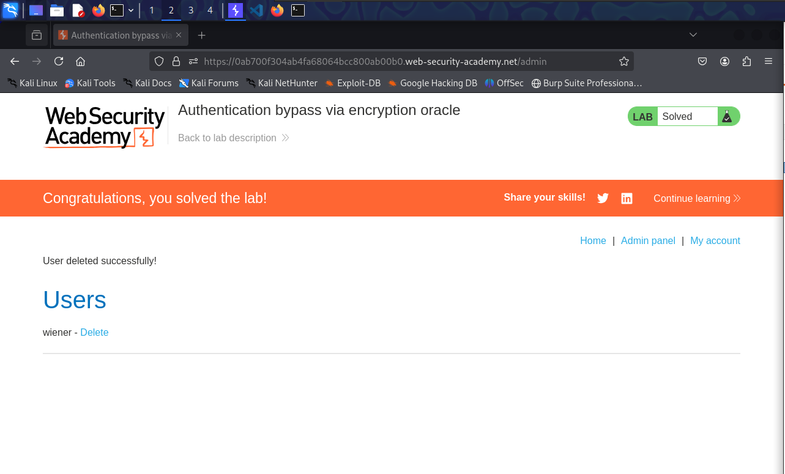

## Golden rule for penetrator
1. always try all possible combinations to test all possible functionalities, do not be lazy boy...

- when the length of the comment is greater than 2048 we get a notification cookie as follows:

- when the given email is not correct, we get this notification: 
  -  notification=5UXp%2fRdml7ChhE0srCGDl2vq2A%2bcUDQdTZ1CRxhxuOA%3d;
- when the comment is longer than 2048 we get this notification: 
  - notification=pQpKA5XAwxU3LQJ25acApsjB4UDpPUdSIfdbu4T6kPB0fq7HwbTRH5%2fsyAagwv6E;
- when the name is longer than 64 char, we get this notification: 
  - notification=LrCunaudMvvD8d%2fzWnpBdLnKea1wXJrjDRLvit4BGBg%3d;
- when the website link is not correct, we get this notification
  - notification=SrIsQEJM%2bv8I%2bOy7hcl%2bucW19yI03FCgFLXq1Oz%2f0xM%3d;

- From this we can observe that we get different encryptions on different error messages. 
- But what is interesting is that these enrcypted messages are the displayed notification. 
- So this imply that the server is able to decrypt the encrypted message :)
- And if we looked closely, we can see that also the stay-log-in parameter is encrypted, so we can try to replace the notification parameter with the stay logged in cookie, and see if we can get something interesting
  - Open burp
  - add a comment and fill other fields
  - intercept the POST request
  - intercept the GET response
  - send both to the repeater
  - Now, in the response, change the notification cookie, to the value of the stay-logged-in cookie
    - 
  - We can see that this cookie, is the user name and next to it a timestamp, so this could imply that if we managed to make the same encryption for administrator:timestamp, we can manage to access admin account, so this will be our target. 
  - now we can consider the POST request as the encryptor, and the GET response as the decryptor.
  - in the encryptor, set the email address to administrator:**timestamp_from_wiener**
    -  
 -  now get the notification token, and paste it in the decrpytor request:
    -  
 -  notice that we got: **Invalid email address: administrator:timestamp**
 -  but we want to have only administrator:timestamp
 -  so we can send the encrypted token to the decoder tab, and remove the first len("Invalid email address: ") bytes which are 23 bytes
    -  send the token to the decoder
    -  decode it from URL
    -  decode it from base64
    -  remove first 23 bytes
    -  encode it to base64
    -  encode it to URL
    -  copy the remaining bytes to the decryptor notificaiton cookie and see what happens: 
       -  
       -  
    -  now notice that we got a new error stating that the server expect the input to be multiple of 16, so lets count the bytes we got from the decoder
       -  %56%41%75%55%31%46%68%33%43%5a%61%37%69%53%58%48%73%6a%78%33%4c%72%74%74%42%37%61%6c%49%77%4a%71%57%31%79%2f%64%67%48%64%35%75%37%4e%73%38%30%64%75%34%37%38%66%72%30%3d
       -  they are 56
       -  I want them to be multiple of 16, so I will add prefix 9 characters to administrator:timestamp.
       -  the reason I added 9 character, because I want the prefix to be multiple of 32, and we have the length of invalid email address:  is 23, so adding another 9 will makes it 32, and we know that the username:timestamp is valid 32 bytes, so now it should work
          -  
          -  xxxxxxxxxadministrator:timestamp
       -  now we can go to the decoder, and remove 32 bytes instead of 23 and see if this will work
          -  
          -  
       -  so now it worked, we can use the encrypted token as the stay-logged-in token  and lets see if it will work.
          -  do not forget to remove the session cookie, to generate new session token for you instead of the wiener session token. 
          -  
          -  it worked, now lets send it to the admin page, and remove carlos, and in each request just remove the session and append the encrpyted token :)
