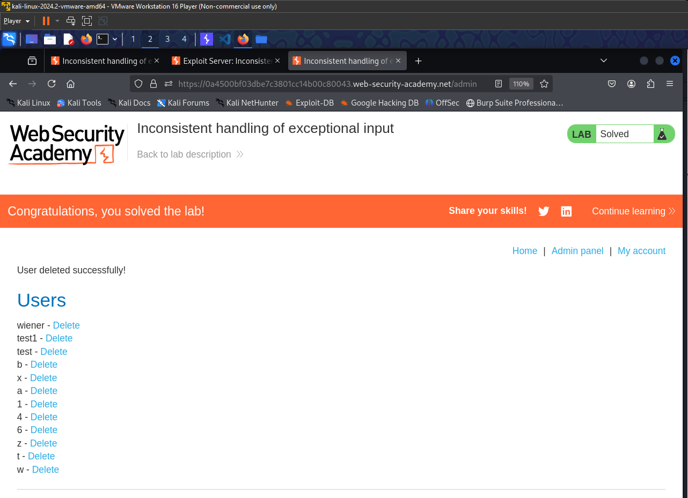
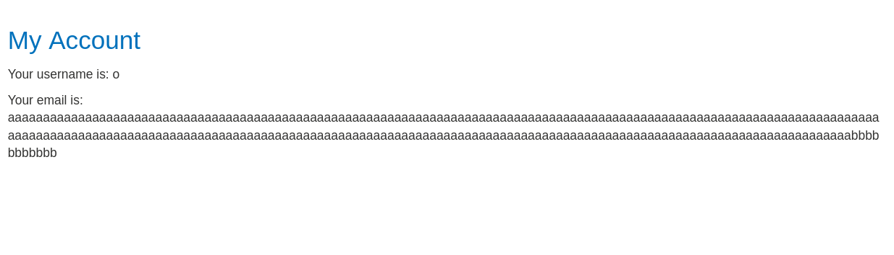
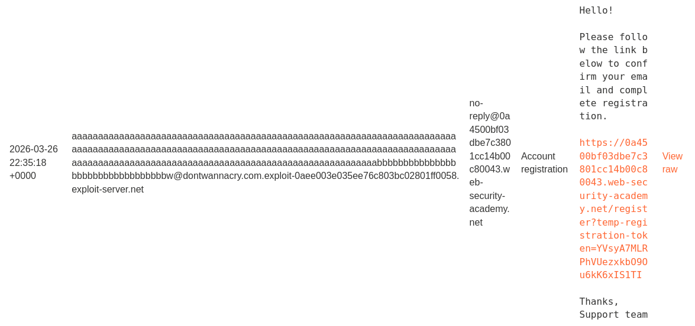
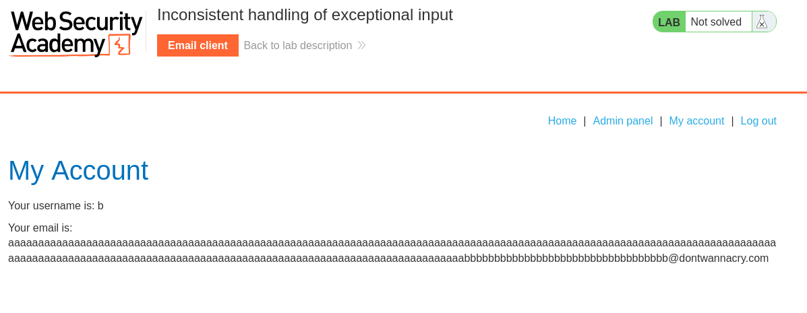

- The thing I learned from this lab is to always check what is the maximum allowed length for the strings on the given validation inputs. 

## Lab solution
1. Go to register tab
2. create a normal account using the email you will find in the email client. 
3. log in with the account you have created. 
4. notice that your email is written in the page. 
5. Log out
6. Try to insert very long name to the email then add your domain
   1. very long means length > 260
7. You will notice that the email address is truncated:
   1. 
   2. here we can not see the @ suffix
8. Now we can try to add the subdomain given **dontwannacry** to the email address, then add our server ID and see if we will get an email
   1. 
   2. You can see that we got an email, because the server allow getting an email for any arbitrary subdomain. 
9. Now you can imagine our plan.
10. We will add a long payload, then we will add the @dontwannacry.**ourServerEmailDomain**, with the goal to just keep the @dontwannacry at the end of the email after the truncation:
    1.  somthine@dontwannacry
11. I wrote down this python script to generate the payload for me:
``` python3 
remaining_len = len(".exploit-0aee003e035ee76c803bc0280")
print(remaining_len)
long_text = 'a' * 204 + 'b' * remaining_len
suffix = '@dontwannacry.com.exploit-0aee003e035ee76c803bc02801ff0058.exploit-server.net'

print(long_text + suffix)
```
12. create a new account with the generated email address and confirm it, and log in with this user, you will see that your email address is ending with @dontwannacry, then go to the admin panal and delete carlos to solve the lab :)
    1.  