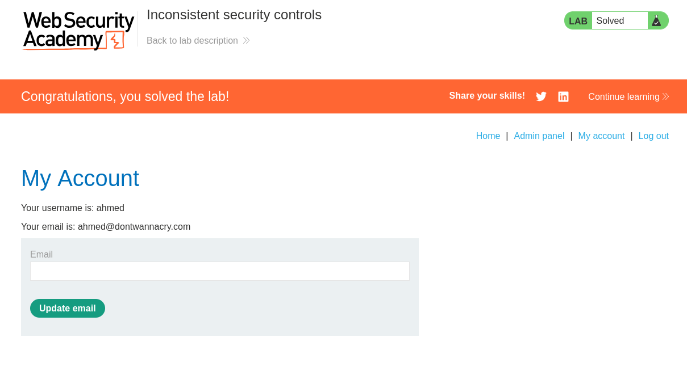
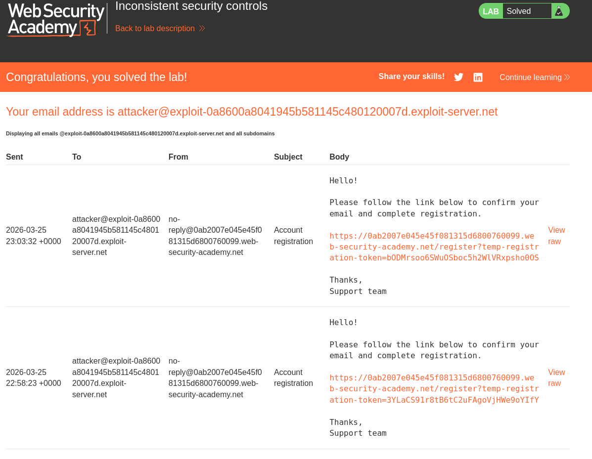

- This business logic assumes that if you have an email address that ends with @dontwannacry.com then you can access the admin panel. 
- All we need to do is to open the registeration page, create a normal account by sending the email address to the attacker@givenserver which we can get from the email clinet button
  - 
- Then we verify the account via the sent link. 
- Go to your profile
- change the email address to something that end with @dontwannacry.com
- now you will see the admin panel button. 
- go to this page and remove carlos. Then you are done :). 