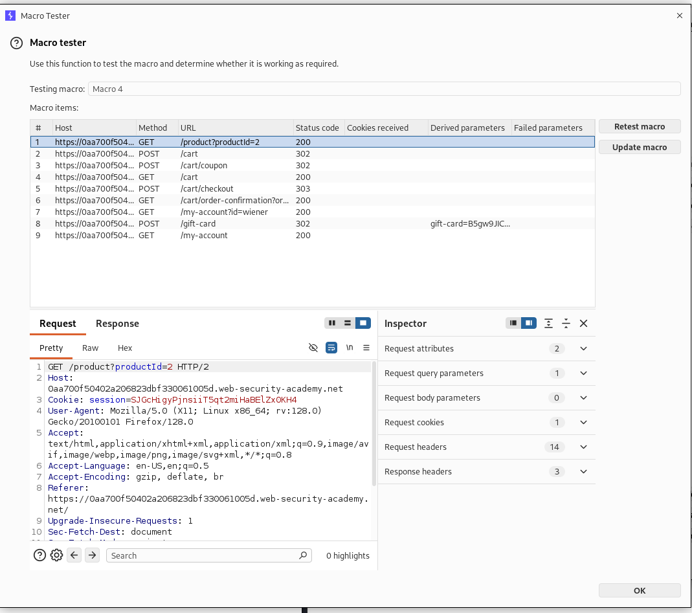
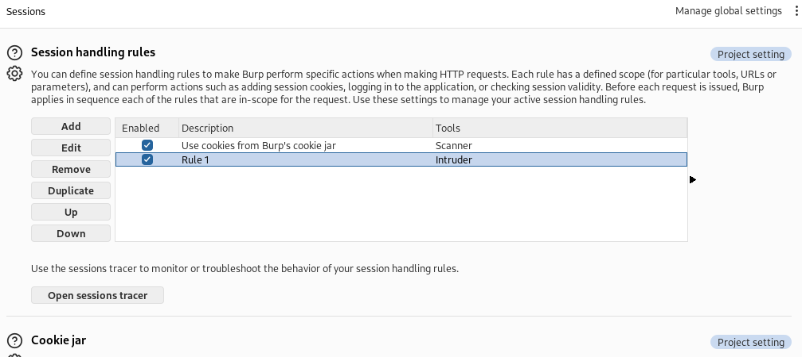
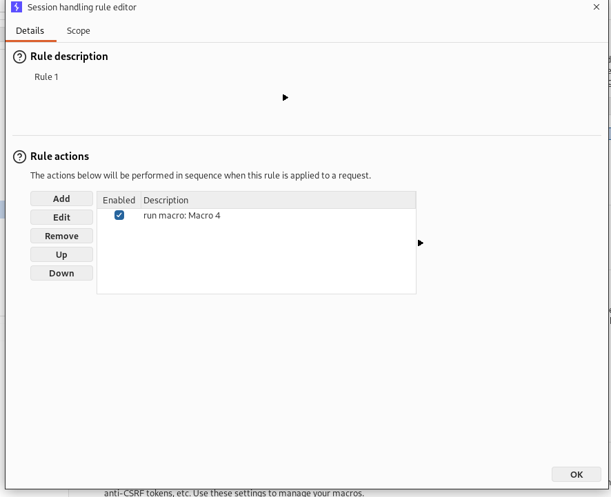
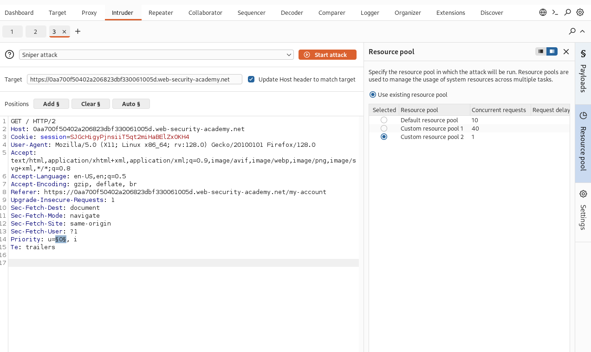
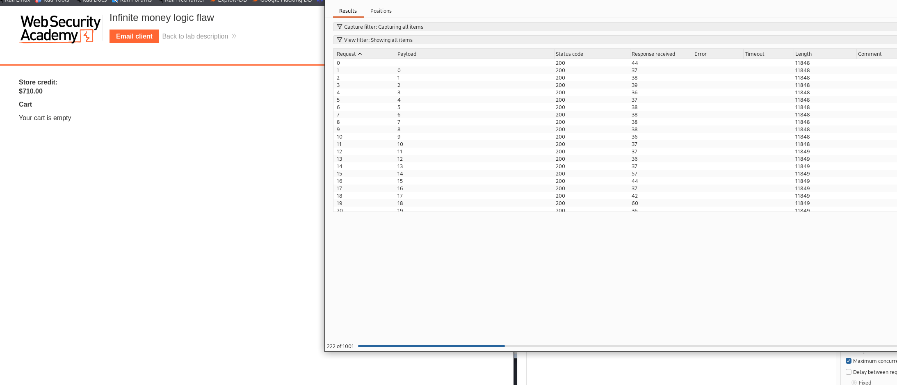
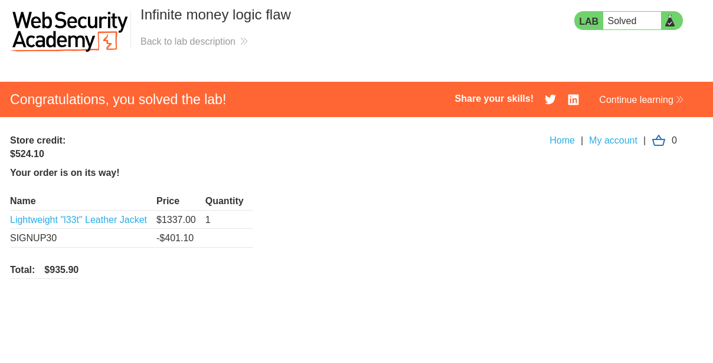

- The main idea here is that there are different copouns that allows us to have infinite credit by which we can buy whatever we want. 

## Lab solution
1. Login as wiener
2. Go to the home page
3. scroll down, and insert any email from which you get the copoun SIGNUP30 
4. in the home page you will find item called gift card
5. add it to the cart
6. apply the copoun SIGNUP30
7. buy the card
   1. you will notice that it gives you a gift card copoun
8. go to your page
9. apply the copoun you got.
10. you get 10$
    1.  so now you notice that you pay 7 and you get 10, which means each time you get 3 dollars for free. 
11. The idea now is to keep repeating the same process until you can buy the jacket. 
12. I will not do it manually, instead, I will use a macro to do this for me instead. 
13. So, just add the same requests in the same valid order
14. Go to request 6, and edit its configuration, and mark the position of the copount and name it gift-card
15. in request 6, mark gift-card to be taken from respond 4, and then test the macro to check if you get the money.
    1.  
16. now test the process and check if it works properly
17. Now go to the Session handling rules
    1.  
18. in the rule actions, add run macro and select your macro
    1.  
19. in the scope select the intruder.
20. then capture a request to the home, and make 1000 requests, and make concurrent request = 1 to avoid any problems, and add the mark on any dummy symbol
    1.  
21. Wait until the attack finish, and you will see that you have enough money to buy the jacket :). 
22. 
23. when you get enough money, you can stop the attack, and go to buy the jacket and finish the lab :)
    1.  