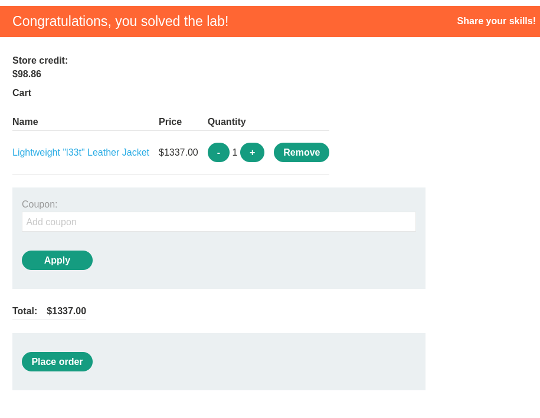

- The main thing I learned from this lab, is that we should not follow the same flow of the application, and try to understand all the request flows in the application. 

## Lab solution
1. Log in as wiener
2. go to home, and check any item that we can afford.
3. open burp and follow all the requests
4. add the item to the cart
5. buy it.
   1. you will notice that when you buy it you call cart/checkout endpoint. 
   2. it returns a request with endpoint cart/order-confirmation which uses GET request with order-confirmed parameter = true. 
   3. this suggests that this is the endpoint which verifies whether the purchase operation was sucessful or not. 
6. now go and add the jacket in your cart
7. resend the captured request from /cart/order-confirmation?order-confirmed=true using the repeater
8. you will find that you have solved the lab successfully :) 