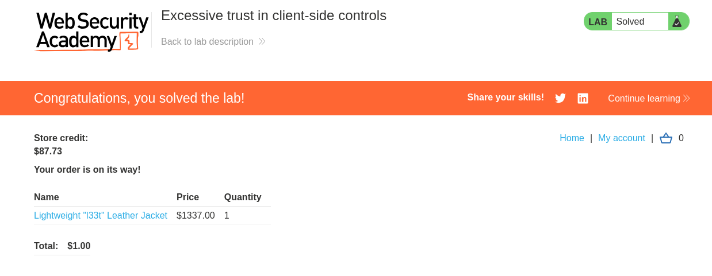
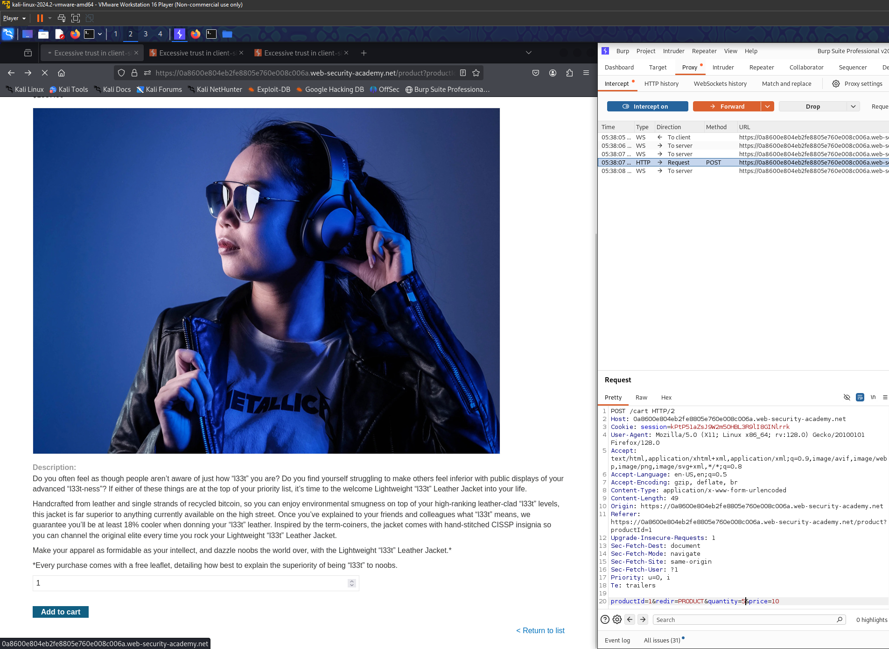

- 
- All we need to do is to open burp, and to login with the given account credentials. 
- Then we open the proxy burp, and navigate to the product Lightweight l33t leather jacket. 
- Then intercept the traffic, you will see that the client side is the one responsible to define the product price and id. 
- so all we need to do is to change the price value to 10 or something less than 100 which is our current balance:
  - 
- Then we will notice that the product is sent with the quantity we defined and also the price, then you just purchase them and you solve the lab :)