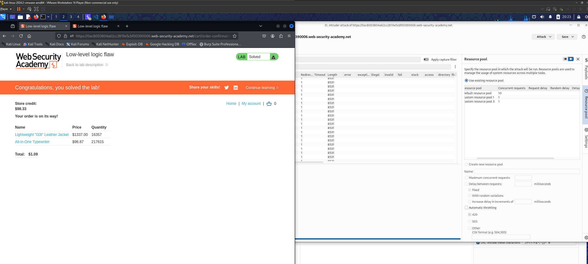

- The main idea is to overflow the price buffer, and then to use another item to get the price in +Ve value. 
- I used the intruder to keep increasing the Jacket quantity until I got -ve value. 
- Then I choose another item with highest cost. 
- Divided the -ve price by (99 * the item price)
  - 99 because there is a limit on the quantity that should not exceed. 
- Then I wrote a python script to create a list with 99 for the result of the division. 
- then I ran the intruder once again until I got the price +Ve. 
- Then I submitted the request to get the lab solved.