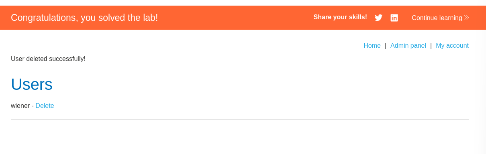

- This lab is very easy, the main idea is that sometimes developers are lazy, and they implement the same function for different user models based on the given parameters. 

## Lab solution
1. Log in with wiener account
2. insert the administrator as user name
3. insert any current password
4. insert new password and confirm it with the same password
5. using burp intercept the update request.
6. remove the current password parameter
7. submit the request. 
8. you will find that the password is changed successfully
9. log out, and perform login with the new password, then go to the admin panal and remove carlos to solve the lab. 