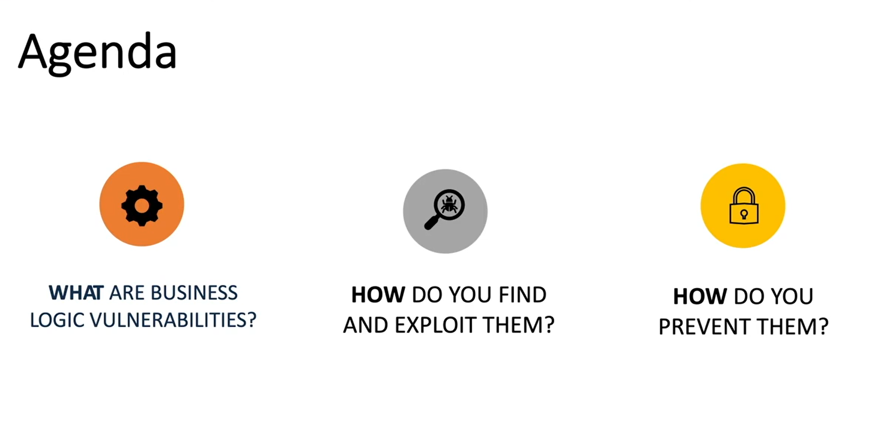
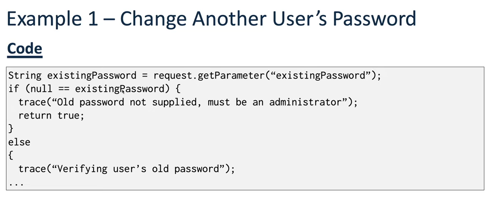
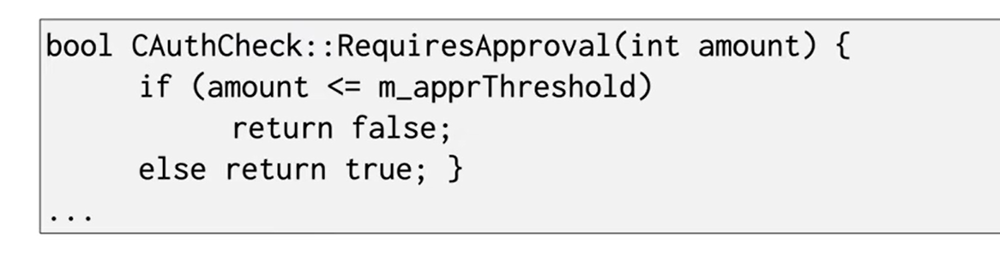
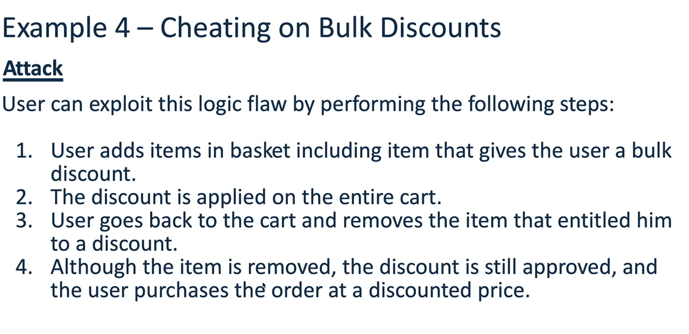
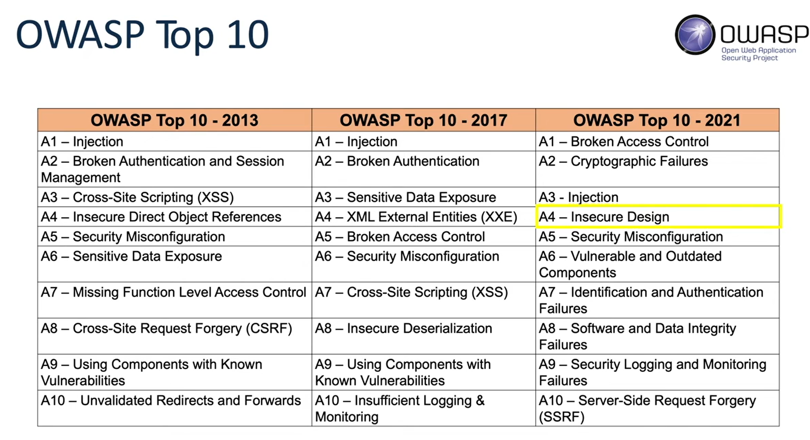

# Business logic vulnerabilites
- 
- They are flaws in the design and implementation of an application that allows an attacker to perform attacks and unintended actions. 
  - such as viewing sensitive data
  - or unauthorized access. 
- This type of vulnerability is very specific for certain application, and it depends on how systems implement their solutions. 
- So here we will cover some examples of business logic vulnerabilities, and then we will solve some labs to get familiar with this vulnerability, and then later we can read more writeups about this topic to get more experience, and later we can start hunting for it. 

## Example 1 - Change another user's password. 
- The application has a password change for end users and administrators. 
- End users need to fill out the username, existing password, new password, and confirm new password fields. 
- Administrator only need to fill out the username, newpassword, and confirm new password field. 
- This can seem okay, but there are some assumptions made by the developers, which ended up having a business logic vulnerability: 
  - The client-side interface presented to users  and administrators is different but the password change is controllered for both users by the same function. 
  - This imply that if the existing password does not exist, it assumes that you are an administrator, which means that an attacker can change any user password and get access to his account. 
    - 
## Example 2 - Bypass checkout functionality
- The application has a "place an order" functionality that follows the following stages: 
  1. Browse the product catalog and add items to the shopping basket. 
  2. Return to the shopping basket and finalize the order
  3. Enter the payment
  4. Enter delivery information
- Assumption is made by the developer that since the application force you to follow these stages, then this is the only way that the user can follow.
- But we know that this is not how the requests works, so this mean that if the attacker managed to capture requests, and called the enter delivery information without calling the payment endpoint, then he will be able to get the items without paying for them. 

## Example 3 - Beating a business limit
- A banking application allows users to transfer funds between bank accounts. As a precaution against fraud, the application prevents users from transferring a value greater than 10k. 
- Assumption: The developers put a check in a place to ensure that no transaction greater than 10k is allowed to go through
  - 
- The main problem with this code, is that they do not consider -ve values, so if they want to transfer 20k from A to B, they can initiate a transfer from account B with amount of -20k to account A bypassing the antifraud defense. 
  
## Example 4 - Cheating on bulk discounts
-  An e-commerce website allows users to order software products and qualify for bulk discounts if a suitable bundle of items was purchased. The following steps involved in the bulk discount functionality: 
    1. User adds items in basket
    2. If one of the items qualifies for a bulk discount, a discount is applied on the entire cart. 
    3. User purchases order. 
- Assumption: 
  - Users will purchase the chosen bundle after the discount is applied. 
- Since the user does not have to follow the same order by using any proxy, then user can bypass the the order, by going back and remove the item that gave him the discount, and then continue the purchase. 
    - 

## Impact of business logic vulnerabilities
- It impacts the confidentiality if it allowed accessing another user data. 
- It impacts the integrity also if it allowed updating other user's data
- And it can impact the availability if it allowed deleting other users data. 
- It depends on the business logic applied in the system, so we can not generalize. 
## How common are they? 
- It falls under Insecure design, and it was in the 4th place for the OWASP top 10 2021
  - 
- It is very common, and many of my pentester friends told me that they usually finds it a lot. 

## How to find and exploit it? 
- Map the application. Make note of each and every component in the application, and how it operates. 
  - if you have access to the code, review the code responsible for each component. 
- For each component determine:
  - The potential business flow
  - The assumptions that could have been made by the developers / architects during the design phase. 
- Test each component for all possible use cases that are outside of the intended business flow. 
- Try tests out of sequence and try different scenarios. 
- usually they are very difficult to find using scanners, because they need a human to understand how the program work, and try to pass it. 

## How to prevent them? 
- Ensure that there is proper documentation of the application's design that outlines every assumption that the designer made. 
- Mandate that all source code is properly commented and includes the following items: 
  - The purpose and intended use of each code component. 
  - The assumption made by each component about anything that is outside of its direct control. 
  - References to all client-side code that uses that component. 
- Write code as clearly as possible
- Perform security-focused code reviews of the application's design. 
- Notice that it is difficult to give advices for this type because it is very specific for every business logic, however the previous advices are common for most of the business logic vulnerabilities. 