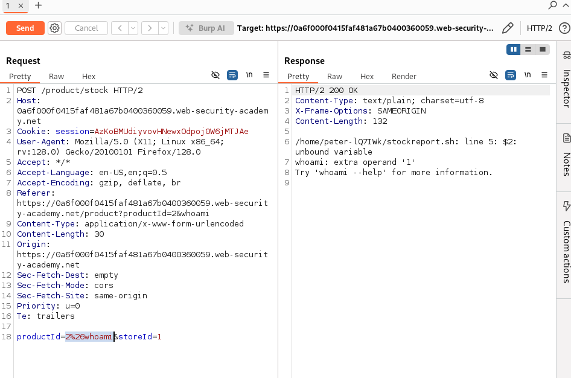
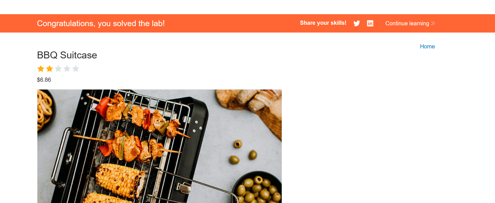

# Lab 1: Lab: OS command injection, simple case
- The main goal of this lab is to excute whoami command in the server and determine the name of the current user. 
- The application has OS command injection vulnerability in the product stock checker. 
  - 
- So all we need to do is to open burp-suite, and intercept the packet sent to the backend. 
- modify the request payload and append this command 
  - > & whoami
  - then url encode it
  - 
- 