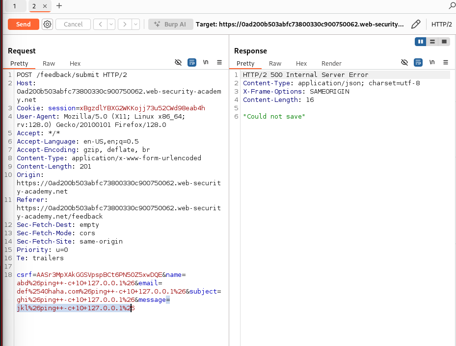

# Lab2: Blind timing exploit
1. Here we will try to perform blind exploit using ping to cause 10 seconds delay
2. The vulnerability is at the feedback page.
3. So we will use this payload: 
   1. > & ping -c 10 127.0.0.1
4. then url encode the payload for all fields
   1. 
   2. 