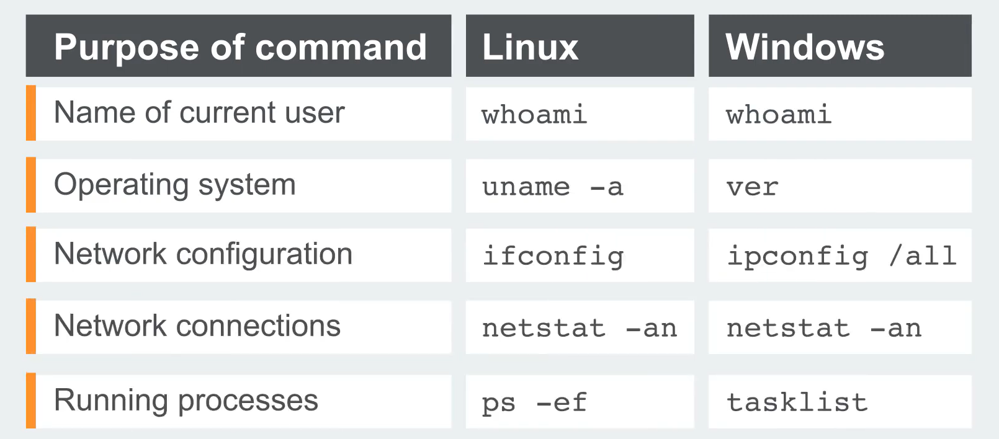

# Command Injection
- It is also known as shell injections. 
- It allows the attacker to excute os command   on the server that is running the application. 
- It is comman that attacker leverage the command injection to compromise other parts on the infrastructure. 

## Injecting OS commands
- imagine url like this:
  - > https://insecure-website.com/stockStatus?productID=381&storeID=29
- the server uses a legacy system and directly call the stock items from the shell using this command: 
  - > stockreport.pl 381 29
- since the appliaction does not make any sort of defences, attacker can inject command like this:
  - > & echo attackerWasHere & 
- This & will force to excute the commands one after another, resulting in excuting the echo and prining it in the http response. 
- 

## Blind OS command injection vulnerabilities
- Usually this kind of vulnerabilities are blind. 
- This mean that the application does not return the output from the command within its HTTP response. 
- but we can still exploit them. 

### 1. Time delay
- First method is to perform time delay using ping:
  - > & ping -c 10 127.0.0.1 &
  - This will cause 10 seconds delay in the response. 

## Common payload:

