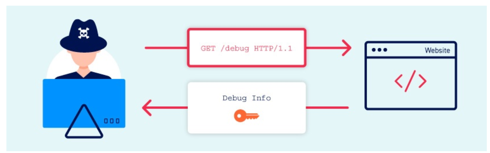

# Information Disclosure vulnerabilities. 
- 
- It is also known as information leakage.
- It is when a website unintentionally reveals sensitive information to its users. Depending on the context, websites may leak all kinds of information to a potential attacker, including: 
  - Data about other users
  - Sensitive commercial or business data
  - Technical details about the website and its infrastructure
- These information can be a starting point for exposing an additional attack surface, which may contain other interesting vulnerabilities. 
- Attacker should interact with the website with unexpected or malicious ways, and carefully study the website's responses to try to identify interesting behaviour. 

## Examples on Information Disclosure
- Reveal the names of hidden directories via **robots.txt**
- Providing access to source code files via temp backups. 
- Explicitly mentioning database table or column names in error messages. 
- Unnecessarily exposing highly sensitive information, sucb as credit card details.
- Hard-coding API keys, IP addresses, database credentials and so on in the source code. 

## How do information disclosure vulnerabilities arise? 
- It can arise in different ways, but these can broadly be categorized as follows: 
  1. Failure to remove internal content from public content
    - E.g developer comments in markup which are sometimes visible to users in the production enviroments
  2. Insecure configuration of the website and related technologies
     - failing in disable debugging and diagnostic features which can give the attacker useful tools to obtain sensitive information. 
     - Default configurations are also vulnerable. 
  3. Flawed design and behavior of the application  
   
## What is the impact of information disclosure
- It can have both direct and indirect impact depending on the purpose of the website. 
- In some cases the disclosing of the sensitive data can have high impact on the customers, like leaking customers' credit card details. 
- In other cases leaking technical details such as directory structure or which third-party frameworks are being used, may have little to no direct impact, however, in the wrong hands, this could be the key information to construct any number of other exploits.
- So, the severity of the attack depends on the attacker, and what he can do with the leaked information. 
  
## How to assess the severity of information disclosure vulnerability? 
- Usually the leakage of technical information is severe if we can only show how can attacker take advantage by this knowledge, and how harmful it can be. 
- for example if the version of the used framework is known, it is severe only if this version is known to be vulnerable. 

## Exploiting information disclosure
- Here are some examples on high-level techniques and tools that we can use to help identify information disclosure vulnerability during testing:
  - Fuzzing
  - Using Burp Scanner
  - Using Burp's engagement tools
  - Engineering informative responses

### 1. Fuzzing
- We can try to submit unexpected data types and specially crafted fuzz strings to certain parameters to see what effect this has. 
- We must pay close attention to the responses, as they can give some hints at the application behavior, for example, there could be small difference in the time taken to process the request.
- Even if the content of the error message doesn't disclose anything, sometimes the fact that one error case was encountered instead of another one is useful information in itself.
- We can automate much of this process using tools such as Burp Intruder, which provides several benfits.
- We can: 
  - Add payload positions to paramters and use pre-built wordlist to fuzz strings to test a high volume of different inputs in quick succession
  - Easily identify differences in responses by comparing HTTP status codes, response times, lengths and so on. 
  - Use grep matching to quickly identify occurrences of keywords, such as **error**, **invalid**, **Select**, **SQL**.
  - We can also use Logger++ extension to define advanced filters for highlighting interesting entries.

### 2. Using Burp Scanner
- for Professional users, there is Burp Scanner. 
- It provides live scanning features for auditing items while browsing, or we can schedule automated scans to crawl and audit the target site on our behalf. 
- Both approaches will automatically flag many information disclosure vulnerabilities for us. 
- For example, Burp Scanner will alert us if it finds sensitive information such as private key, email address, or credit card number in response. It can also identify backup files, director listings, and so on. 

## Common sources of information disclosure
- Here are a list of common places to look at to see if sensitive information is exposed
  1. Files for web crawlers
     - robots.txt 
       - sometime include directories that crawler should skip, which may contain sensitive information
     - sitemap.xml
     - It is always worth navigating to robots.txt and sitemap.xml 
  2. Directory listing
     - Sometimes servers are configured to automatically list the contents of directories that do not have index page present. 
     - This can help an attacker by enabling them to identify resources at a given path. 
     - It increases the exposure of sensitive files within the directory that are not intended to be accessible to users such as temp files and crash dumps. 
  3. Developer comments 
  4. Error messages
     - One of the most common causes of information disclosure is verbose error messages. 
     - General rule we should pay close attention to all error messages we encounter during auditing.  
     - Content of error messages can reveal information about what input or data type is expected from a given parameter, which help narrowing down our attack by identifing exploitable parameters, and prevent us from wasting time trying to inject wrong payloads. 
     - Sometimes also it reveals the version used by the framework, which can help us to search for exploit for that version.
  5. Debugging data
     - For debugging purposes, websites usually generate custom error messages and logs that contain large amount of information about the application behaviour, this information is usfull during debugging, but it is very dangreous during deployment, as it allows high leakage of production information.
     - It can contain vital information such as: 
       - Values for key session variables that can be manipulated by the user
       - Hostnames and credentials for back-end components
       - File and directory names on the server
       - Keys used to encrypt data transmitted via client
     - They may be logged in separate files, if the attacker was able to access them, it can be useful reference for understanding the application runtime state.
     - It may also give several clues as to how they can supply crafted input to manipulate the application state and control the information received. 
  6. User account pages
     - By nature, the used account page usually contains sensitive information, such as the users' email and phone number. 
     - Users should only have access to their own account page, but if there is a logic flaw, then attacker may be able to access others pages
       - > Get /user/personal_info?user=u1
     - if attacker changed it to u2, then it can cause a problem of getting u2 data. 
  7. Backup files
  8. Insecure configuration
  9.  Version control history