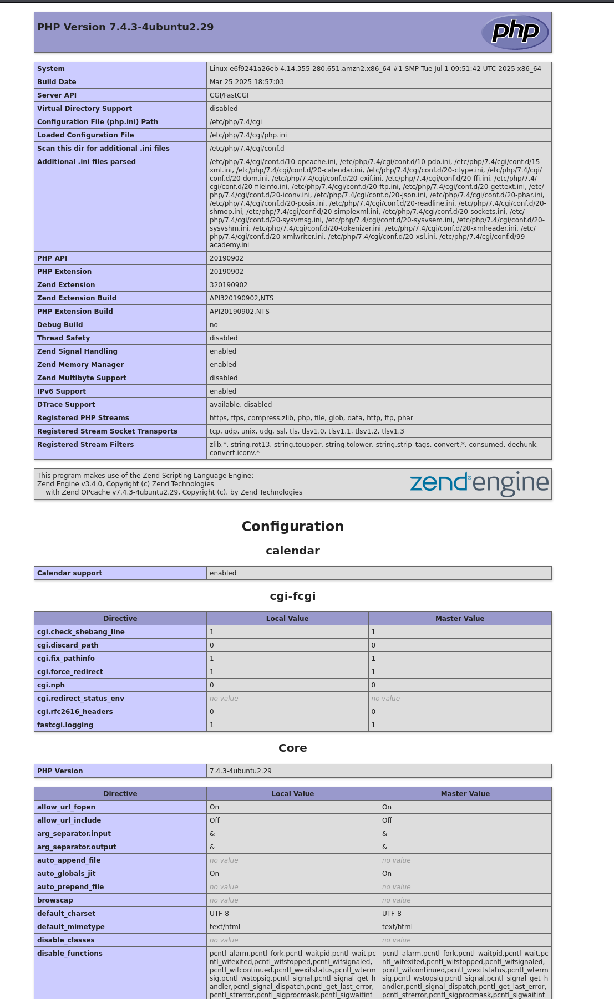
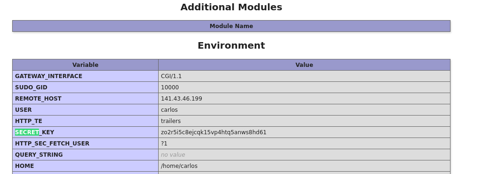
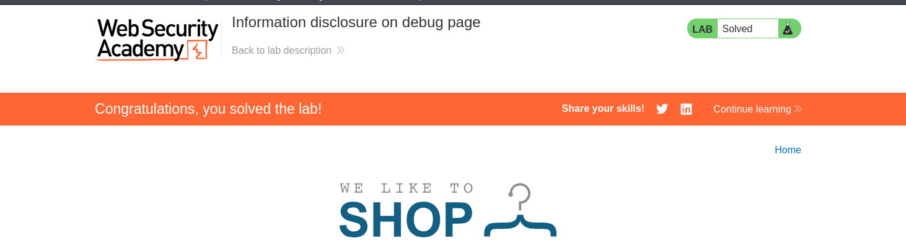

- All we need to do, is to open the console, and look at the HTML, and look for all divs, and we will find this comment: 
  - <a /cgi-bin/phpinfo.php> Debug </ a>
- which indicates that this is the debug page, go to it
- 
- we can search for SECRET_KEY
  - 
  - zo2r5i5c8ejcqk15vp4htq5anws8hd61
- on submitting it, we get the banner: 
  -  