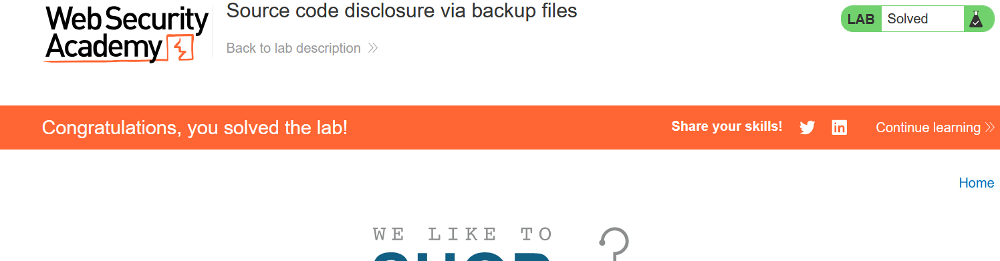

- we need to go to robots.txt
- then everything will be easy :)
- You will find /backup endpoint
- when you open it, it will show you backup file
- when you open it, you will find the password: vv26wd6cdxb7enrtiwrmp3qrikidds11
- on submission: 