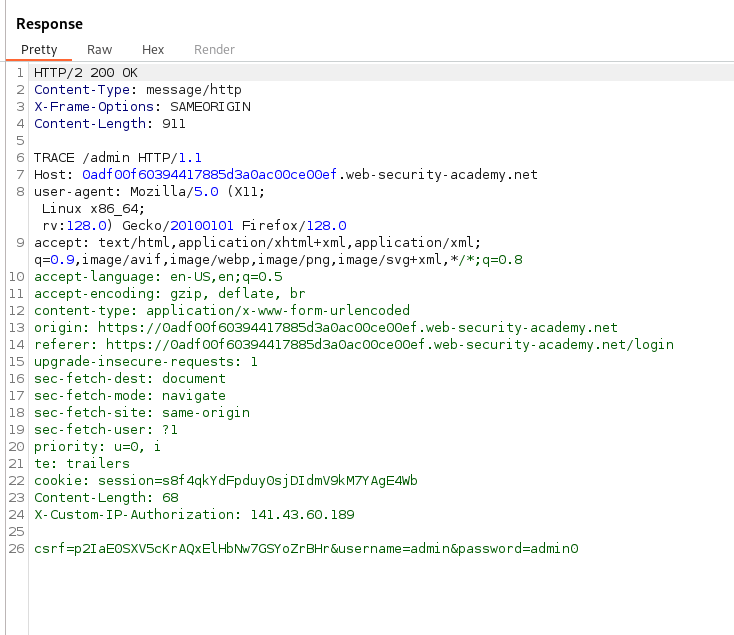
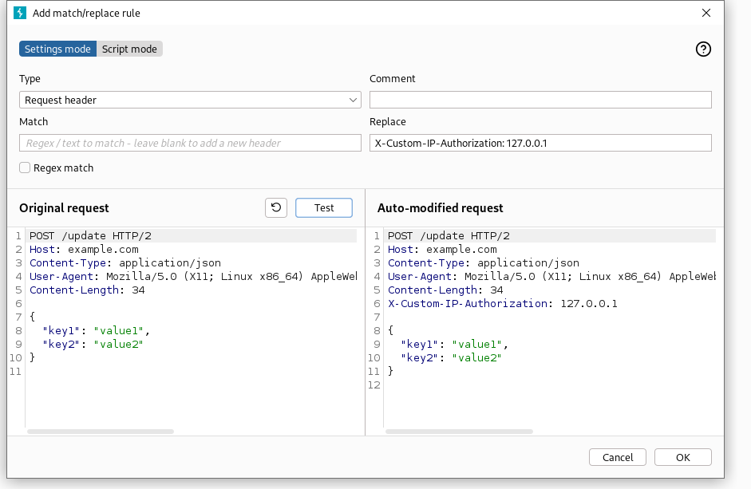
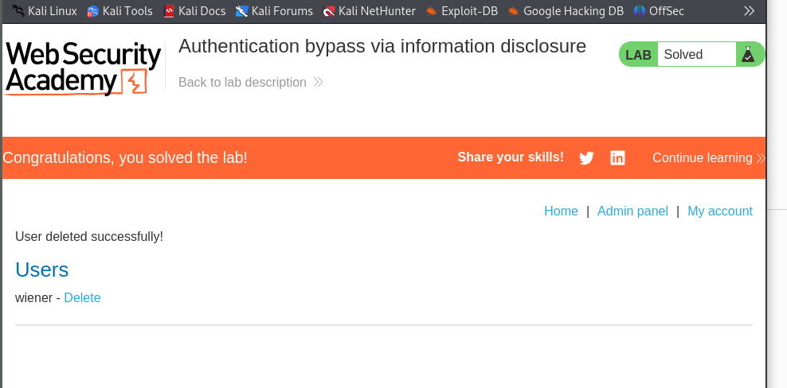

- We need to know that admin interface is usually at /admin endpoint. 
- Also we need to know the TRACE method in HTTP, which usually used for debug purpose, and when used, it performs message loop-back test alog the path to the target resource. 
- if enabled, the webserver will respond to requests that use the TRACE method by echoing in the response the exact request that was recieved. 

## Solution steps: 
1. go to /admin endpoint
2. you will find that it says only admin user can access. 
3. open burp
4. send the request to the repeater
5. change the method from GET /admin to TRACE /admin
   1. 
6. Yo can notice X-Custom-IP-Authorization with your own IP, it is a header containing our IP, and used to detect if the request coming from localhost or not. 
7. Go to Proxy in Burp
8. Go to Match and replace tab
9. Under HTTP match and replace, press Add
10. Select Type: Request header
11. in Replace paste this: X-Custom-IP-Authorization: 127.0.0.1
12. press Test and you will see that it always append it in the request
    1.  
13. press ok, and go to the website and go to the home.
14. You will notice that you can access the admin panel
15. go to it, and remove carlos to solve the lab
    1.  