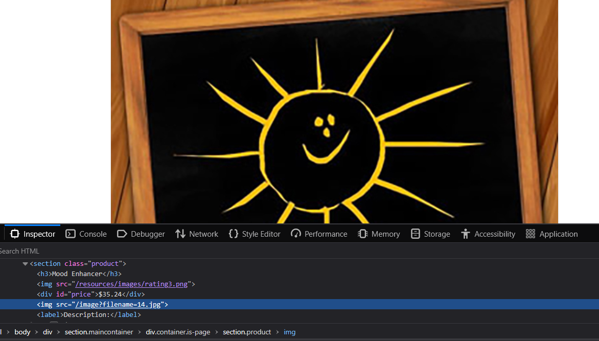
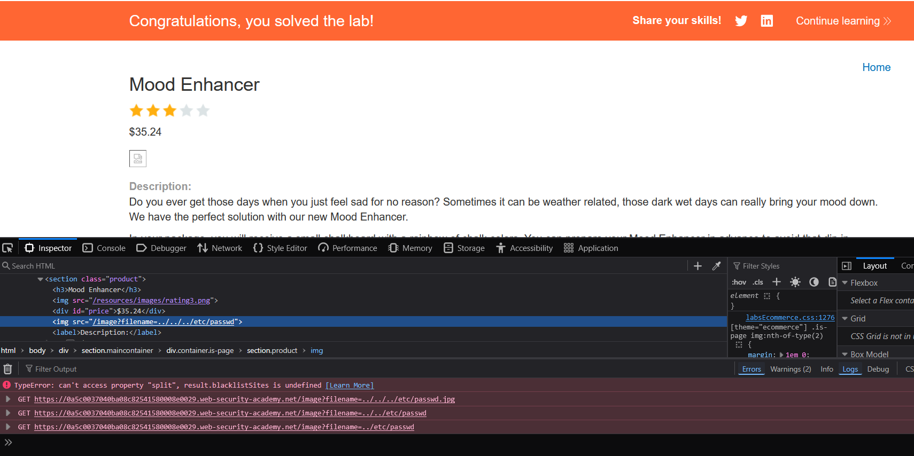

- The description says that the system has vulnerability in products displayed, so we need to open the inspector, and see how the images look like
  - 
- So we can see that the backend retrieve the image with filename=14.jpg
- So what we can do, is to try to change this file name to different payloads, and check if we can get the /etc/passwd
  - Payload1:
    - /etc/passwd -> didn't work
    - ../etc/passwd -> didn't work
    - ../../etc/passwd -> didn't work
    - ../../../etc/passwd -> lab solved :)
    - 