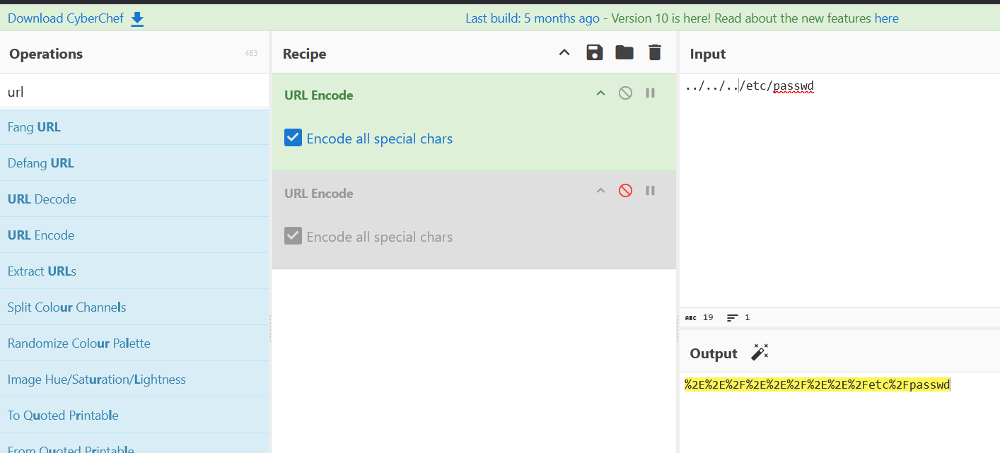
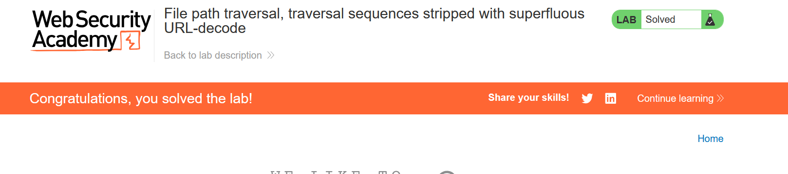

# File path traversal, traversal sequences stripped with superfluous URL-decode

- here we need to encode the path that we need to retrieve
- so we will write this payload: 
  - ../../../etc/passwd
- then we go to [cyberchef](https://gchq.github.io/CyberChef/#recipe=URL_Encode(true)URL_Encode(true)&input=Li4vLi4vLi4vZXRjL3Bhc3N3ZA)
- Then we choose url encode
  - %2E%2E%2F%2E%2E%2F%2E%2E%2Fetc%2Fpasswd
- try to submit it, it will not work. 
- so do another encoding. 
- then try to submit it, it will work:
  -  
  -  Lab Solved
  -  