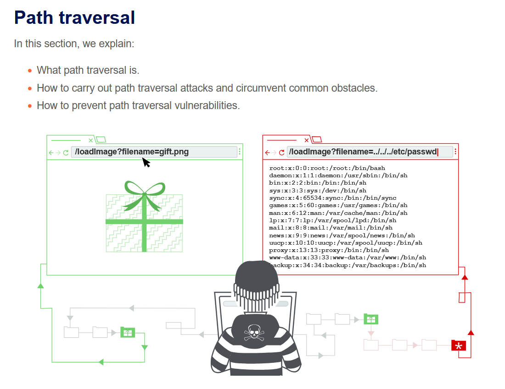
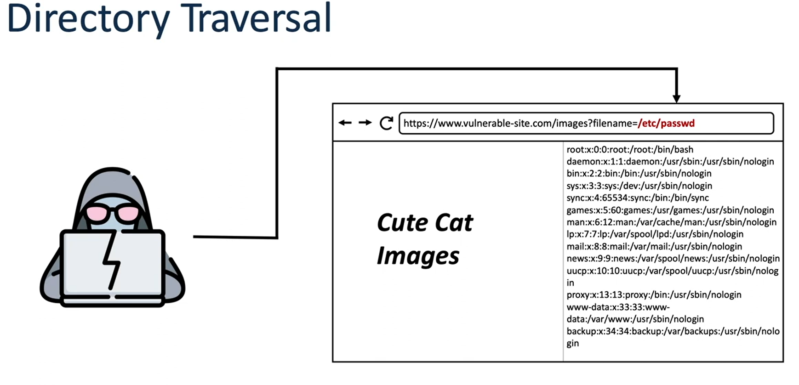
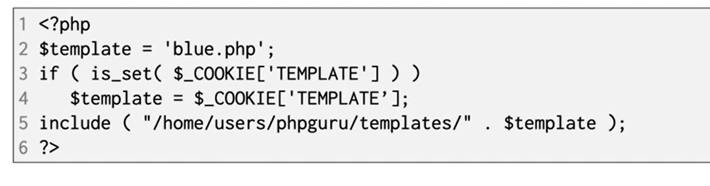
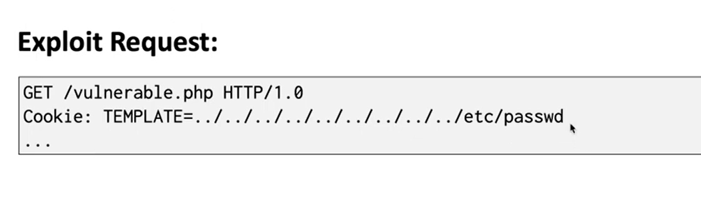
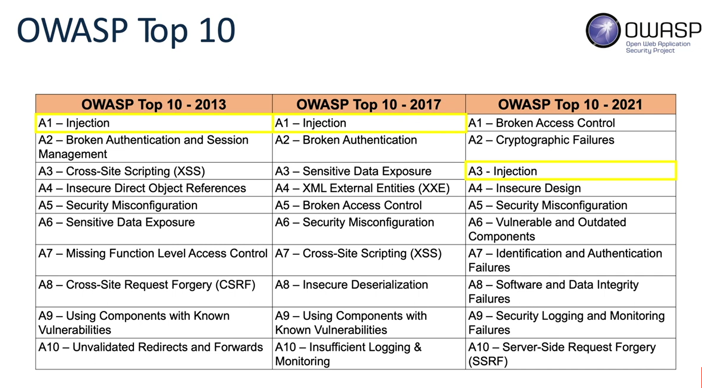
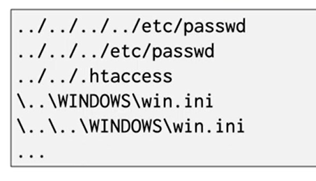
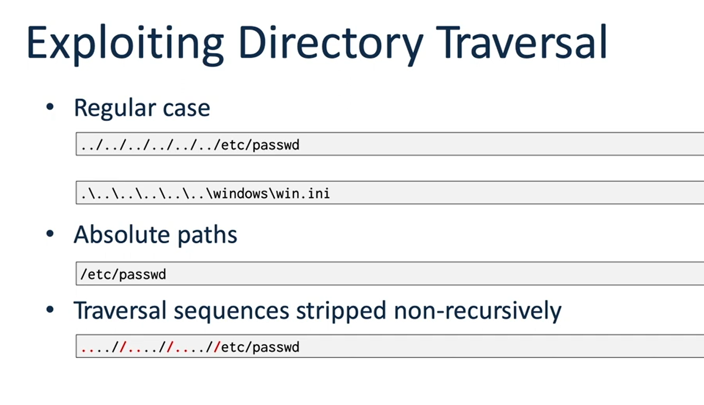
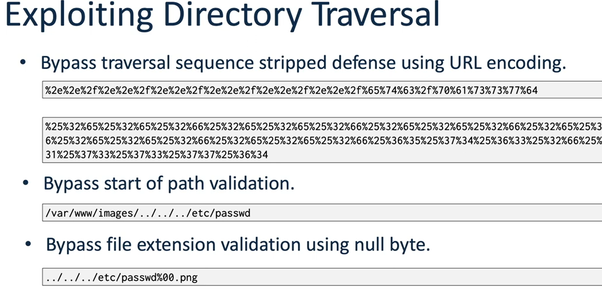
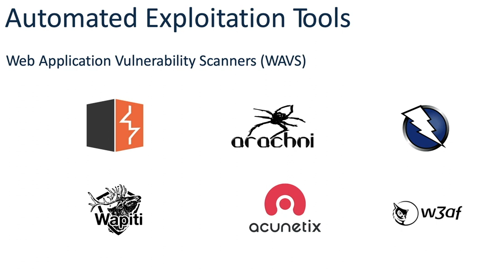
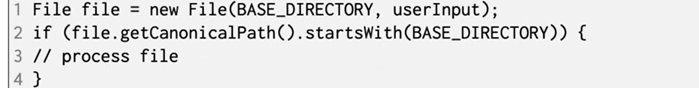

# Path traversal explaination
- 

## What is Path traversal 
- It is also known as directory traversal. 
- These vulnerabilities allow attacker to read arbitrary files on the server that is running the application
- This might include: 
  - Application code and data
  - Credentials
  - Sensitive OS files 
- In some cases the attacker might also write arbitrary files on the server, allowing him to modify application data or behavior, and ultimatly take full control of the server. 
- This can happen if the user is allowed to ask for any file on the server, and it returns it without any validation
  - 
- so in this case, instead of reading cute_cat image, attacker is able to retrieve all users hashed passwords. 

## How to spot the vulnerability
- usually this happens if the system does not validate user input properly
  - 
- so in this case, the user input validation is directly added to the function, which allows the attacker to modify it and set it to any required value. 
- so in this example, the attacker can modify it to this request: 
  - 
- this payload go back to the home, and then try to get the users passwd.
- this is comman payload in the path traversal. 

## Impact of Directory Traversal vulnerability. 
- Usually we discuss the impact in terms of CIA. 
- So, it allows unauthorized access to the application:
  - Confidentiality: Allows the attacker to read files from the system. 
  - Integrity: Some cases allow the attacker to run commands and therfore alter files on the system. 
  - Availability: Some cases allow attacker to run commands and delete files from the system. 
- If the directory traversal vulnerability allows us to run commands, then we can get full code execution on the server.    

## How common and critical is PT ? 
-   It is usually included in the Injection category in OWASP top 10
    -   
-  So in 2021 it was listed third

## How to find it? 
- Depends whether it is blackbox or white box

### Black box: 
1. Map the application:
   - Identify all instances where the web app appears to contain the name of a file or directory
   - Identify all functions in the application whose implementation is likely to involve retrieval of data from a server filesystem. 
2. Fuzz all these instances with common payloads
   - 
3.  We can automate the process using web application scanners (WAVs)

### White box:
1. Identify instances where user-supplied input is being passed to file APIs or as parameters to the OS. 
   1. Identify instances in a running application first (from black-box prespective) and then review the code responsible for that functionality
   2. Grep on functions in the code that are known to include and evaluate files on the server and review if they take user supplied input
   3. Use a tool to monitor all filesystem activity on the server, then test each page of the application by inserting a single unique string.
      1. Then set a filter in the monitoring tool for that specific string and identify all filesystem events that contain that string. 
2. Validate potential directory traversal vulnerabilities on a running application. 

## How to exploit them? 
1. Regular case: 
   1. Try to traverse back to the passwd file using relative or absolute pathes
      1. 
   2. The stripped method is used when the application doesn't automatically perform the stripping for back-slashes, so you need to do them manually. 
2. Url Encode the payload
   1.  Sometimes the validation system check the given string, and to bypass it, you are required to encode or double encode the payload. 
3.  provide the starting path. 
    1.  Sometimes the validation requires that the payload starts with certain directory, so all you do is that you include this start location, then add ../ to go back. 
4.  Bypass using null byte when the application requires that you end the payload with certain extension
    1.  

## Automated Exploitation tools
- almost all tools have scanners to allow to search for such vulnerabilities
  - 
- So, instead of searching for them manually, we use any of these tools to search for it.

## How to prevent DT ?
- The best way to prevent it is to avoid passing user-supplied input to filesystem APIs.
- if this is not avoidable, then there are two layers of defense should be used:
  1. Validate user input by comparing it to an allow list of permitted values. if not possible, ensure that it contains alphanumeric characters only. 
  2. After validation, use filesystem APIs to canonicalize tha path and verify  that it starts with the expected base directory
  3. 