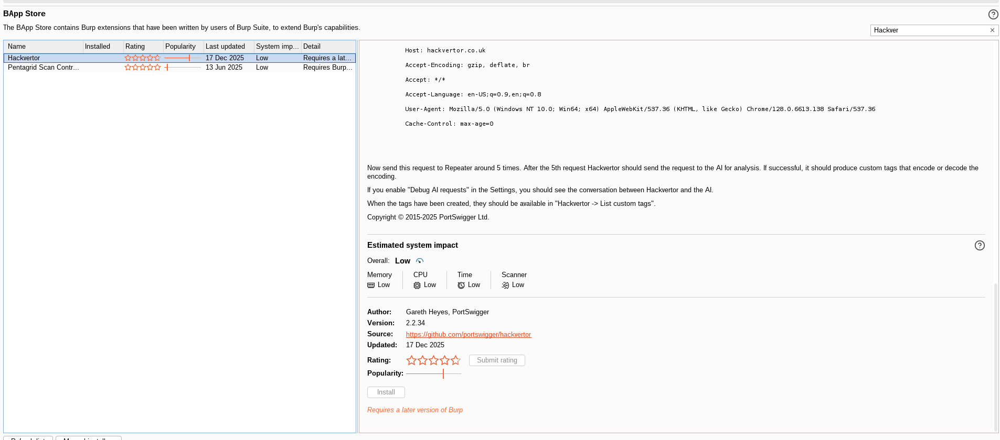
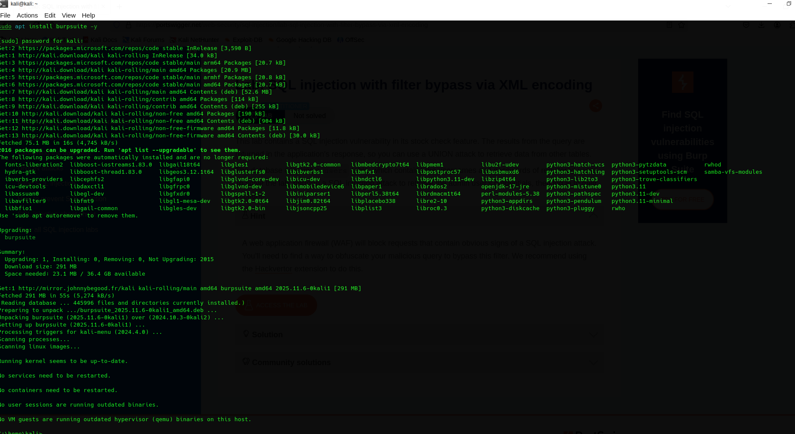
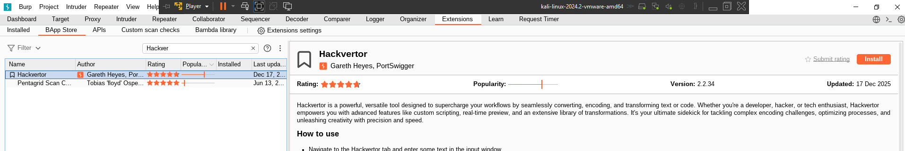

- Here the website use website-application-firewall (WAF) which block any request with obvious signs of SQL injection.
- So to solve it we need to use an extension in Burpsuite called: **Hackvertor**
  
## Hackvertor install
1. Open Burpsuite
2. Go to Extension tab
3. Go to BApp Store sub-tab
4. Search for Hackvertor
   1. 
5. install it. 

> For my case, it needs higher version of burp-suite, so I needed to update it first to be able to use it
    
 - 
- After Update, I can install hackvertor succesfully:
  - 

## What is Hackvertor? 
- It is Burb Suite extension that lets you encode, decode, transform, and mutate payloads inline using a simple tag-based syntax, which is useful for bypassing filters and WAFs during web exploitation.

## Crash course how to use it: 

### What it does:
- Transform payloas inline (encode/obfuscate) inside Burp so we can bypass filters/WAFs without manual encoding.

### Where we can use it?
- It appears in:
  -  Repeater
  -  Intruder
  -  Proxy
-  So anything we send from these tools gets auto-transformed

### Core Syntax 
- simple:
  > <@tag> PAYLOAD </@tag>
- neasted:
  >  <@tag1><@tag2>PAYLOAD</@tag2></@tag1>

### Common tags
- Encoding 
| Goal               | Tag                    | Description |
|--------------------|------------------------|-------------|
| URL encode         | `<@urlencode>`         | Encodes special characters using URL encoding (e.g. `'` → `%27`). Used to bypass filters that block raw SQL keywords or symbols. |
| Double URL encode  | `<@doubleurlencode>`   | Applies URL encoding twice (e.g. `%27` → `%2527`). Useful against WAFs that decode input only once. |
| XML encode         | `<@xmlencode>`         | Encodes payload using XML entities (e.g. `'` → `&apos;`). Commonly used in XML-based requests to bypass SQLi filters. |
| HTML encode        | `<@htmlencode>`        | Converts characters to HTML entities (e.g. `<` → `&lt;`). Helps bypass input validation in HTML contexts. |
| Base64             | `<@base64>`            | Encodes the payload in Base64. Useful when the backend decodes Base64 input before processing. |
| Hex                | `<@hex>`               | Encodes characters as hexadecimal values. Often used to evade keyword-based filters. |
| Random case        | `<@randomcase>`        | Randomizes character casing (e.g. `SeLeCt`). Useful against case-sensitive keyword filters. |

- SQL-specific
| Goal                     | Tag             | Description |
|--------------------------|-----------------|-------------|
| SQL CHAR() encoding      | `<@sqlchar>`    | Converts the payload into SQL `CHAR()` function calls (e.g. `admin` → `CHAR(97,100,109,105,110)`). Used to bypass keyword and quote filters. |
| SQL comment obfuscation  | `<@comment>`    | Inserts SQL comments (`/**/`) between keywords (e.g. `SELECT` → `SE/**/LECT`). Helps evade simple pattern-matching WAFs. |
| Whitespace bypass        | `<@whitespace>` | Replaces normal spaces with alternative SQL-valid whitespace (tabs, comments, or encoded spaces) to bypass space-based filters. |

### Examples
1. Basic SQLi Bypass (Will be used in this lab)
   - <@urlencode>' OR 1-1--</@urlencode>
2. Double encoding to bypass WAF
   - <@doubleurlencode>' OR '1'='1</@doubleurlencode>
3. xml encoding
   - <@xmlencode>' OR 1=1--</@xmlencode>

## Lab solution 
- From the name of the lab, it is required to use the xml encoding to bypass the WAF filter
  - <@xmlencode> PAYLOAD </@xmlencode>
- It is also required to find the SQLi vulnerability in the stock check feature