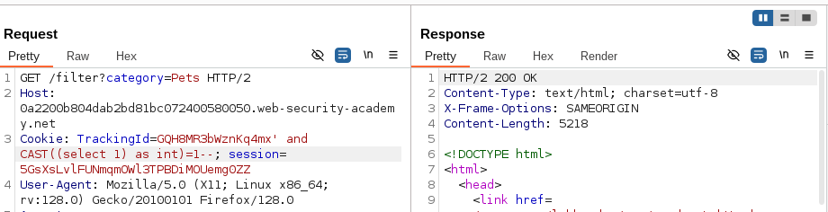
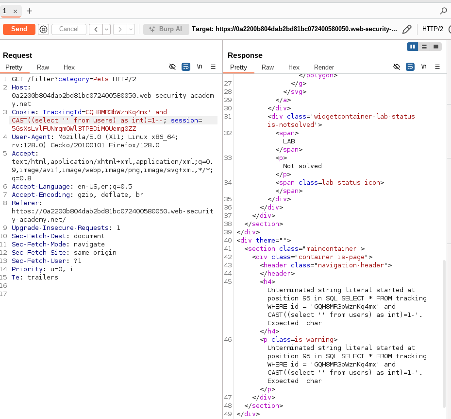
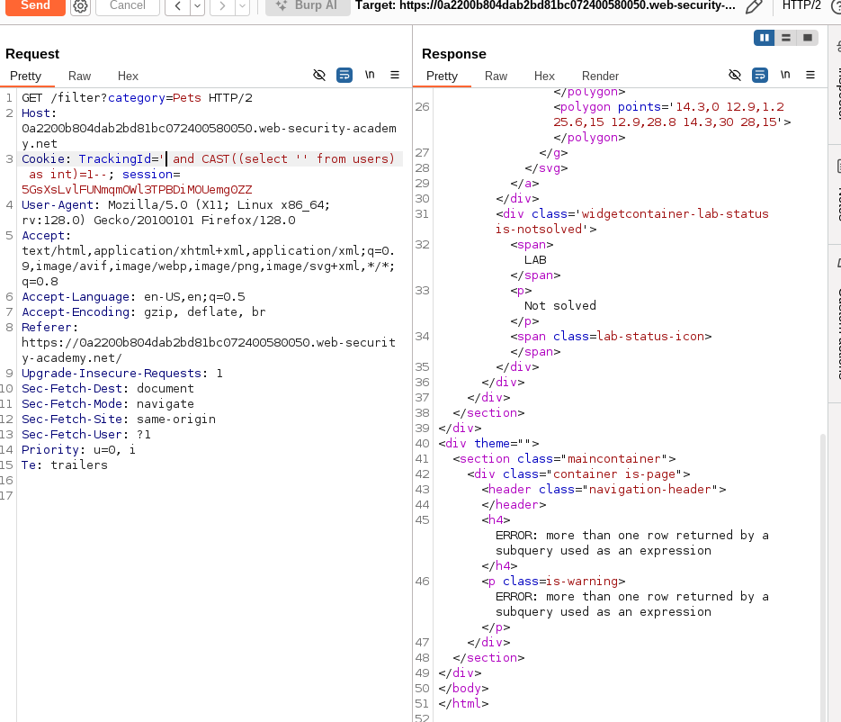
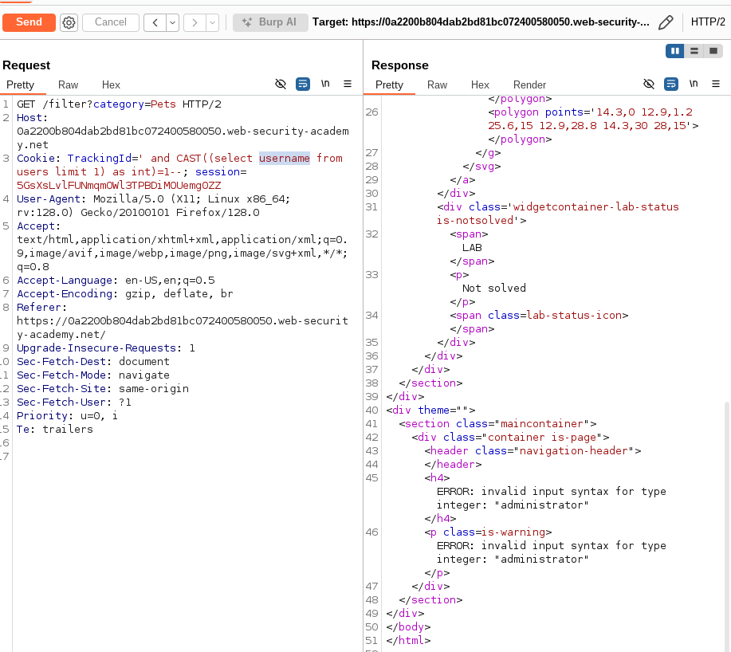
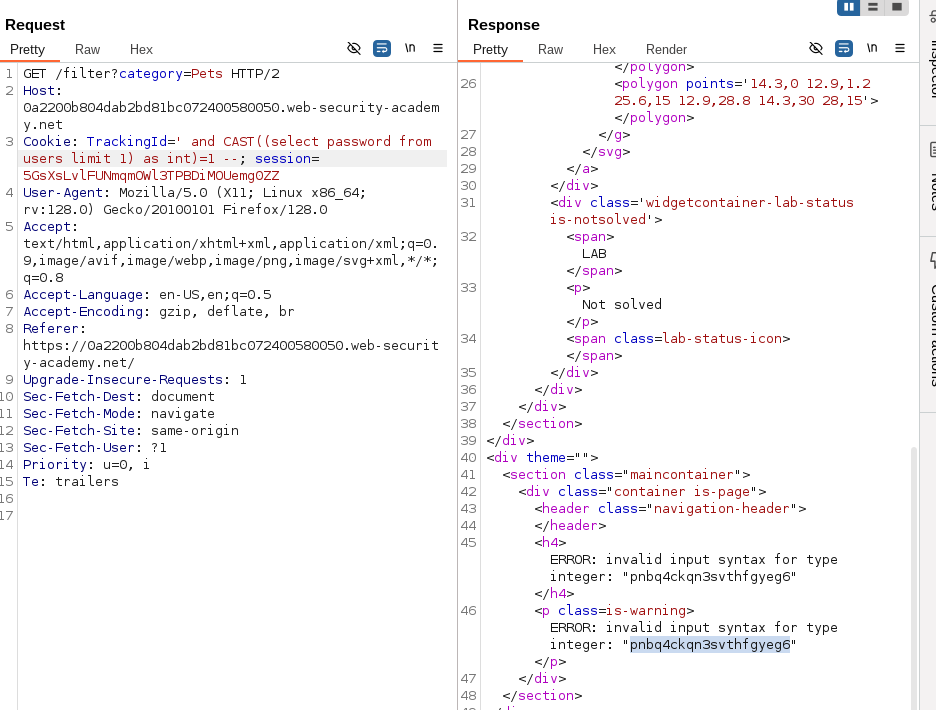
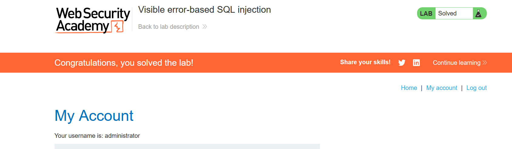

# Lab: Visible error-based SQL injection
- This lab is similar to the previous one, but here we will see that the server sometimes gives us what is the exact error caused by our sqli query

## End goal
- Retrieve admin credential and log in. 
## Solution
- First we need to know where is the vulnerability. 
    - It is in the cookie TrackingId
- Then we need to determine what kind of errors we have
    - Error
    - Blind -> this is our case 
    - out of bound
- Then we need to check if the users table exist
    - in this lab we will need to excute the cast function to be able to acheive boolean query. 
    - cast function takes the input, and the type you need to convert to
    - payload: 
        - > ' and CAST((select 1) as int)=1--
        - 
    - Now we need to modify our query to check if the users table exist
    - payload: 
        > ' and CAST((select '' from users) as int)=1--
    - on this payload I got error, but happily, the server told me exactly what was the problem: 
        - 
    - It says that there is unterminated string, but I am sure that my string is closed, so we can guess that the backend performs some sort of validation, and truncate the query. 
    - so what we can do here is to remove the trackingId string because it is not important, and check if we will get the same error. 
        - 
    - so we can see that we got new error, which is expected, because our query select multiple entries from the db, so we need to limit it to 1
    - payload: 
        - ' and CAST((select username from users limit 1) as int)=1--
    - now we can see that it leaked the name of the first entry in the users table:
        - 
    - Now, we will try to get his password
    - payload: 
        - ' and CAST((select password from users limit 1) as int)=1--
    - then we retrieved the password: 
        - 
    - now we can login with the retrieved credentials: 
        - 
    