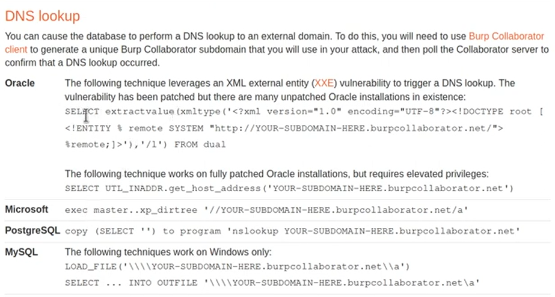

# Lab: Blind SQL injection with out-of-band interaction
- We finished the Time based Blind SQL.
- Now we need to learn how to perform Blind out-of-band SQLi
  
- Since I do not have access to profissional Burpsuite, so I can not instantiate a server, but I will write down here, how can we manage to solve this lab if we have access to the profissional tool. 

- The end goal of this lab is to exploit SQLi and cause DNS lookup
- Analysis: 
  1. Create server from Burp colaborator: 
     1. cgwihkkm39dtusfdnklfsdalknfds.burpcollaborator.net
  2. go to the [cheatsheet](https://portswigger.net/web-security/sql-injection/cheat-sheet) and see the payloads used for DNS lookup
     1. 
  3. Since we do not know the DB type, so we need to fuzz all of them until we can know which type is used. 
     1.  if you used it, you will find that it is Oracle
  4. If you tried all of them, and they are not working, then it is not vulnerable. 