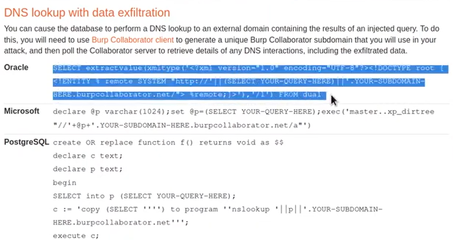
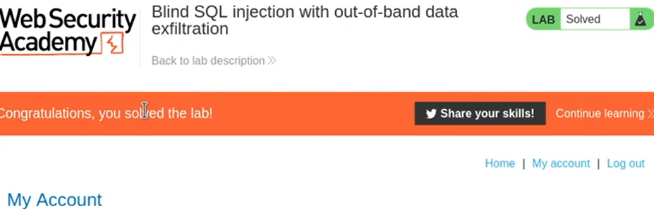

# Lab 17: Blind SQL injection with out of band data exfiltration | Long Version
- All we need to do, since we know that this is Oracle DB, is to go to the [Cheatsheet](https://portswigger.net/web-security/sql-injection/cheat-sheet) and check how to perform data exfiltration
  - 
- Then on using this command, to the burp public server, we can get all the data we need. :)
  - 