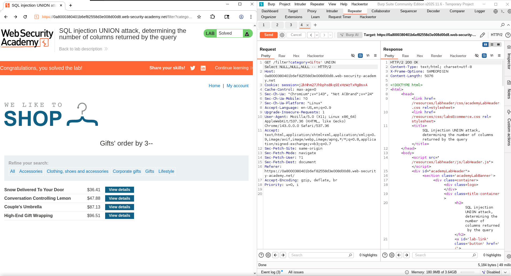
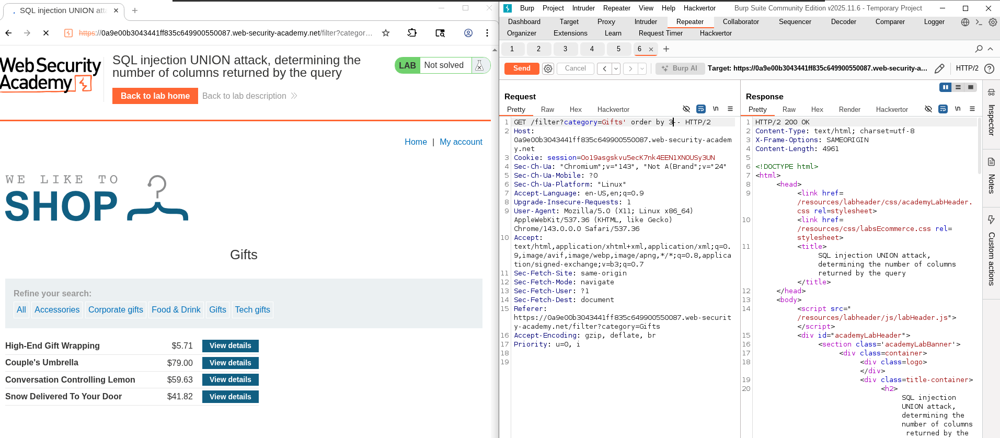
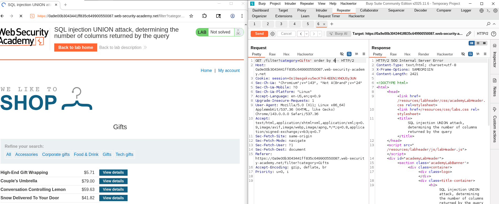

# Lab: SQL injection UNION attack, determining the number of columns returned by the query
- The main goal of this lab is to determine the number of columns used in the table category.

- There are two methods to do so. 

## 1. Using Union (the required method for this lab)
- To do so we first need to understand how Union work
- Union is a statement in SQL that manage to concatinate the results from two different tables into single output
- i.e:
  - Assume we have table 1 with two columns a,b, and table 2 with two columns c,d
  - Table 1:
    - a: [1,2,3]
    - b: [x,y,z]
  - Table2: 
    - c: [5,6,7]
    - d: [a,b,c]
  - now if we want to retrieve data from both tables, we can use this statement: 
    - Select a, b from table1 Union Select c,d from table 2
  - The result will be one table with all data:
    - Result: 
      - c1: [1,2,3,5,6,7]
      - c2: [x,y,z,a,b,c]
  - But there are two main rules to be able to use Union:
    1. The tables must have the same column number
    2. columns must be combatible:
       - having the same datatype for corresponding columns  

### 1.1 Attack scenario
- To be able to use this method to retrieve the number of columns, we using this query:
  - > ' Union select Null --
- the idea is that we should keep getting errors until number of nulls be same as number of columns

### 1.2 Apply
- Open Burp suite
- open proxy
- Go to lab
- Click on any category
- send the request to the repeater
- Modify the request in the repeater, and keep incrementing NULLs until you match the number of columns which is 3: 
  - > query: ' Union Select Null, Null, Null--
  - 
  - Don't forget to start with ' and to end with -- usually. 

## 2. Using order by
- The order by statement order the output by the given column index.
- So our idea is to use it, starting from 1 until we get error, then we can know that number of columns = error_idx - 1

### 2.2 Apply
- In the repeater change the query parameter to: 
  - Gifts' order by 3
    -  -> final correct request
  - Gifts' order by 4
    -  -> error
  - So we can know that the # of columns is 3.
- 