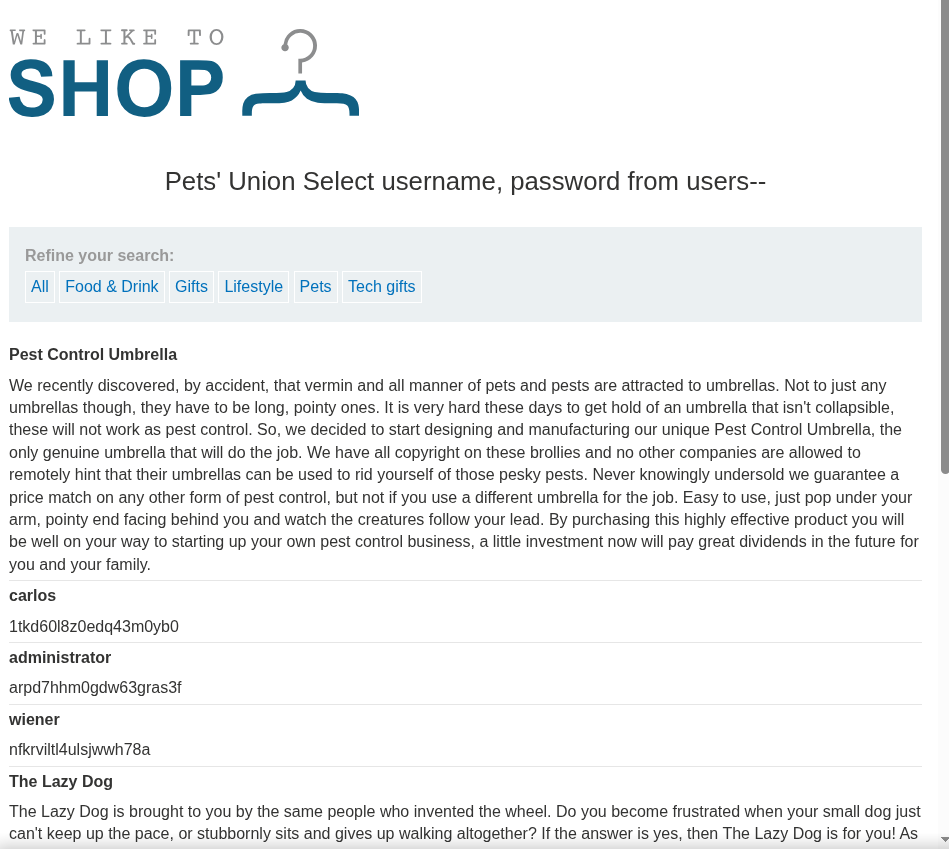

# Lab: SQL injection UNION attack, retrieving data from other tables

- After finishing the previous two labs - [retrieve columns](../Lab3-Determining_Number_of_columns/writeup.md) and [retrieve string](../Lab4-Determining_column_with_string/writeup.md). 
- We are now ready to retrieve data from different tables.
- The main goal of this lab is to be able to retrieve username and password from users table, then use the retrieved information to log in as administrator.

## Steps:
1. Determine the number of columns
   - They are not 3 as the previous labs, here we will start the whole process from the begining.
   - So following the same steps from this [lab](../Lab3-Determining_Number_of_columns/writeup.md) you will find that we have 2 columns only.
2. Determine the datatypes of columns
   - We should expect that both of them are strings, but to ensure, follow steps explain in this [lab](../Lab4-Determining_column_with_string/writeup.md)    
3. Use Union statement: 
   1. > ' Union Select username, password from users --
   2. 
4. Now use the given credentials to log in as admin.
   1. Go to My account
   2. enter the retrieved credentials:
      1. 