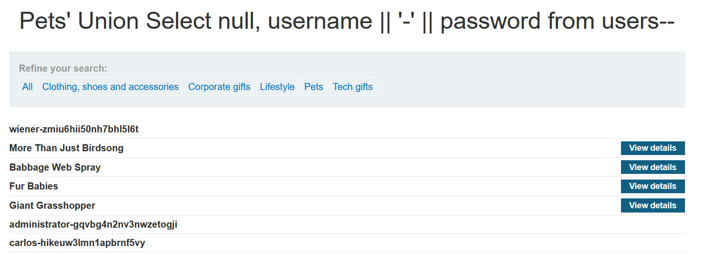
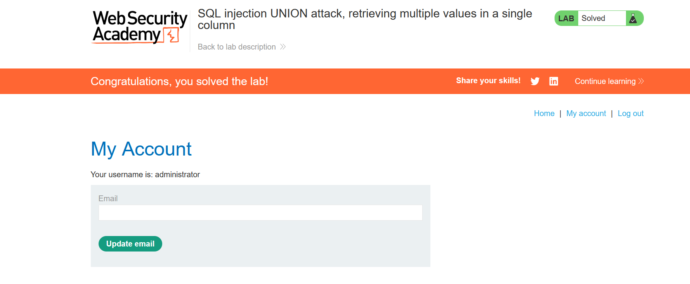

# Lab: SQL injection UNION attack, retrieving multiple values in a single column
- Sometimes you will have a vulnerability in a page, but you want to retreive number of columns more than the available ones in the vulnerability. 
- So, in this case, we want to retrieve usernames and passwords, and we will find that we have only one column with compatible datatype. 
- So we are going to learn how to do so. 

## Solution steps: 
1. As we learned in previous labs, there are two main steps to do when you start: 
   1. Find number of columns using Union or order by -> you will find they are 2. 
   2. Find the datatype of each column using Union null,'a' -> you will find that only the second column has datatype string.
2. Now in order to finish this, we will need to do the following: 
   1. First naive idea is to query each value separatly:
      1. ' Union select null, usernames from users--
      2. ' Union select null, password from users--
   2. Second idea is to use concatination, to concatinate two columns into single column. 
      1. In order to do so, first you need to figure out which database you are dealing with. 
      2. In this [cheatsheet](https://portswigger.net/web-security/sql-injection/cheat-sheet) you can find various commands which can help you learn how to use concatenation and also what commands to use to be able to know the DB version. 
      3. So, we need to try different functions to know which DB we have:
         - ' Union Select null, @@version-- to check for Microsoft DB or MySQL
           - **PostgreSQL 12.22 (Ubuntu 12.22-0ubuntu0.20.04.4) on x86_64-pc-linux-gnu, compiled by gcc (Ubuntu 9.4.0-1ubuntu1~20.04.2) 9.4.0, 64-bit**
         - ' Union Select null, version()-- to check for PostgreSQL DB  => we will find that we use this. 
       4. Then now we can use this concatination payload to concatinate users with passwords
          1.  ' Union Select null, username || '-' || password from users--
              1.  
      5. Now we have admin username: Administrator and his password:   gqvbg4n2nv3nwzetogji
      6. So we can go to my account page, and login:
         1. 