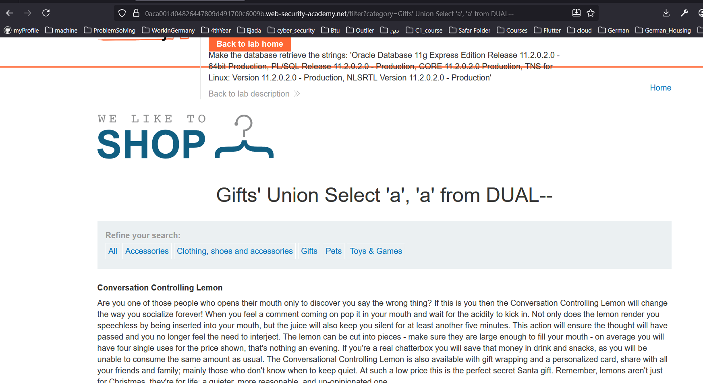
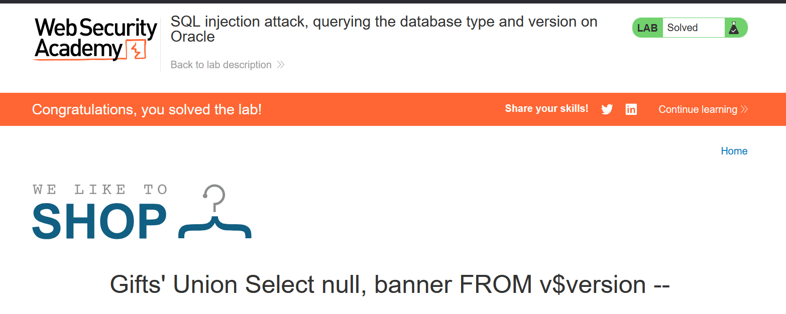

# Lab: SQL injection attack, querying the database type and version on Oracle
- All we need to know is the version of the used database. 
- We can find how to query this in this [cheatsheet](https://portswigger.net/web-security/sql-injection/cheat-sheet)

## Solution:
1. Knowing number of columns -> order by 3 cause error, then # of columns = 2. 
2. Knowing their datatype
   1. Now if you tried the same approach that we usually use:
      1. ' Union Select 'a', 'a' 
   2. You will get error, and the reason for that, is oracle Databases requires a from clause. 
   3. But the problem is that we do not know the schema of the database, so we need a dummy table.
   4. Luckly if you went to oracle database documentation, you will find that they provide a dummy table in any schema which is accessible by all users which is called **DUAL**, so now we should craft our payload as following: 
      1. ' Union Select 'a', 'a' from DUAL--
      2. 
3. Looking in the cheatsheet to know how to find the version in oracle: 
   1. SELECT banner FROM v$version
   2. SELECT version FROM v$instance
   3. So our payload should be: 
      1. ' Union Select null, banner FROM v$version 
   4. 