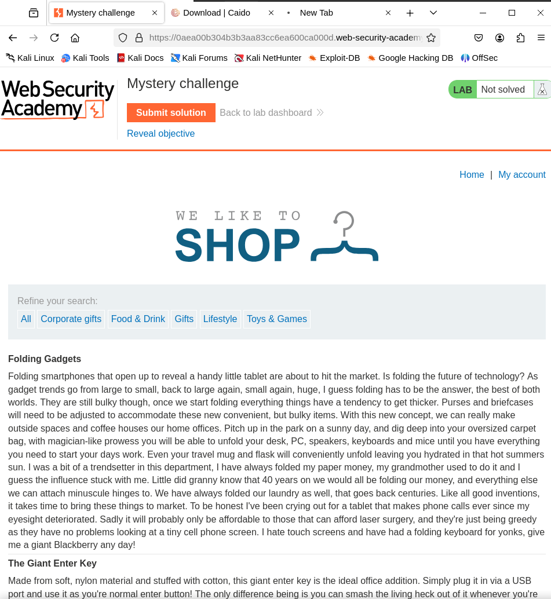
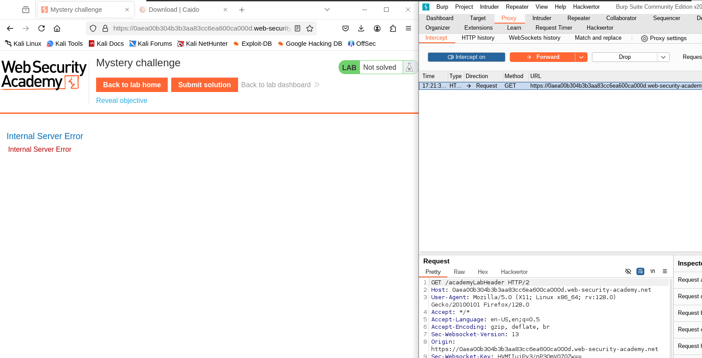
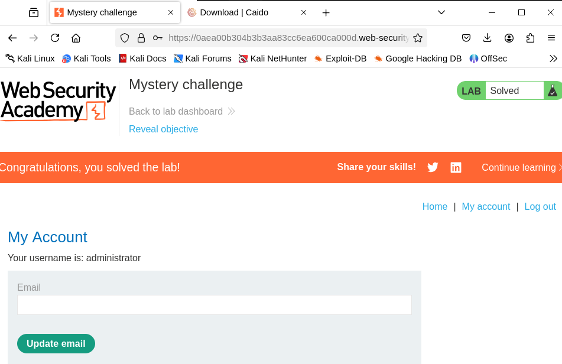

# SQLi Mystry Lab1
- After finish learning about SQLi vulnerabilities, now we need to practice to find vulnerabilities ourselves without being told where is it, and also which type exactly, and in which parameter, so I need to look for it myself. 
- 
- The main goal is to log in as admin

1. I will first check the filters
   1. 
2. Now, we need to know how many columns exist
   1. ' order by 3 -- => caused error
   2. So I know that the number of columns are 2
3. Now we need to determine the datatype
   1. ' Union select 'a','a' -- 
4. Now We can safely select username and password
   1. 