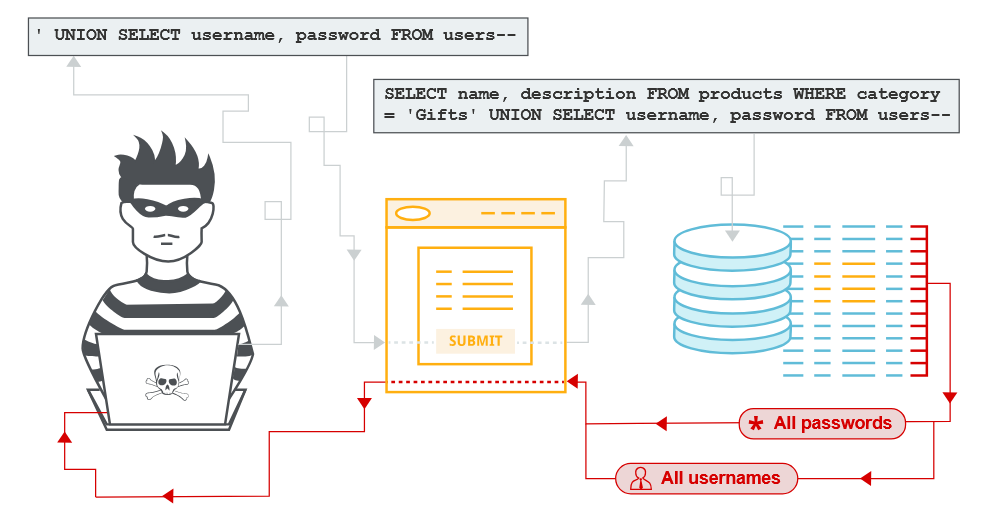
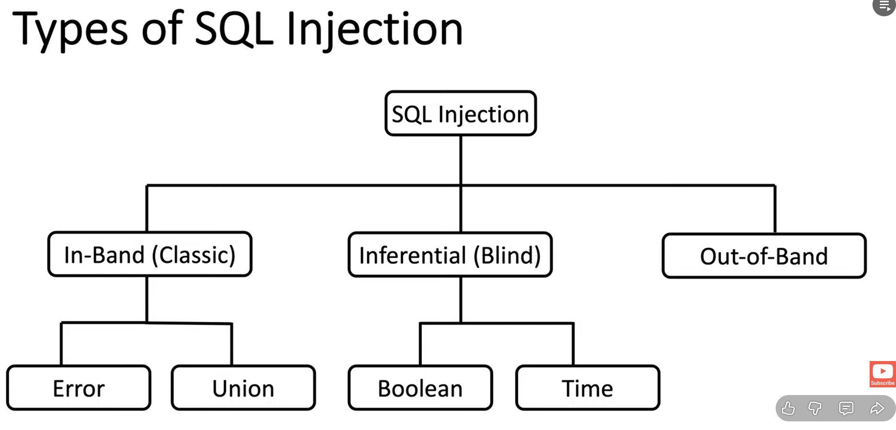
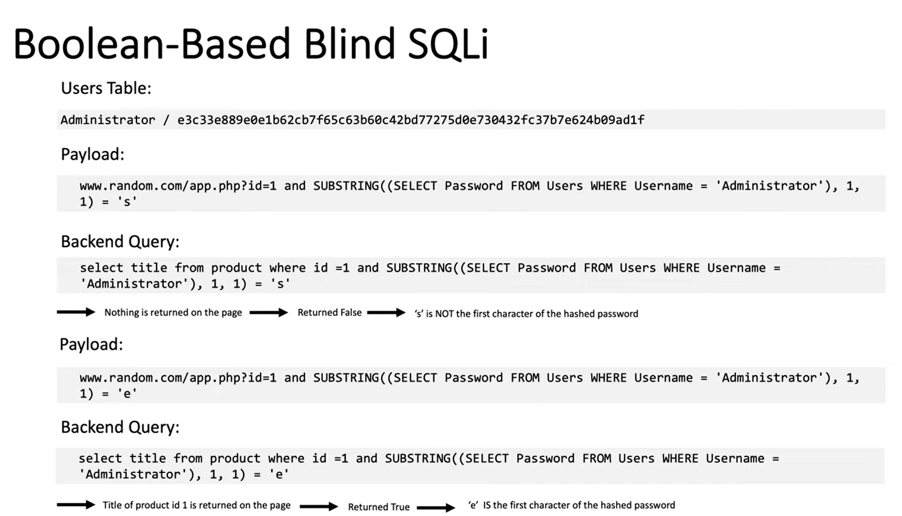
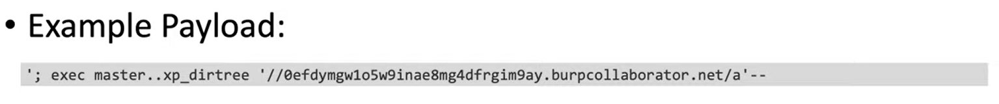
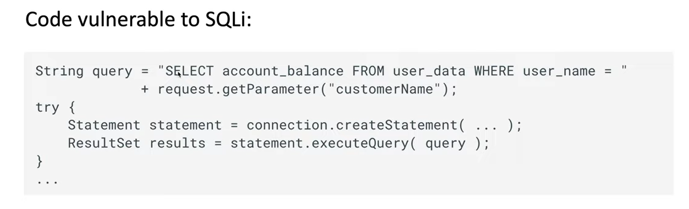
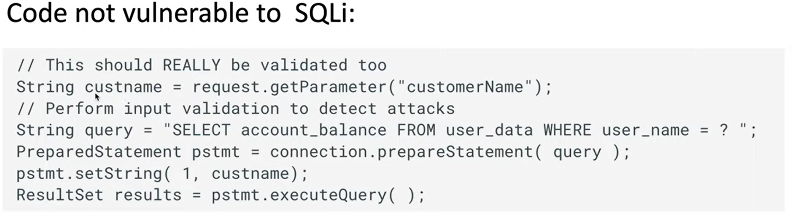
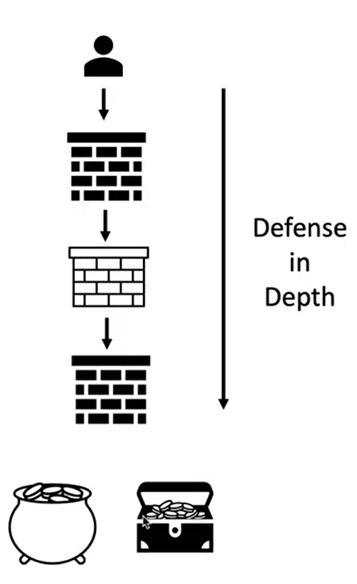

| Field       | Value                           |
|-------------|---------------------------------|
| Author      | Abdelaziz Neamatallah           |
| Date        | 25.12.25                        |
| Description | Start learning about SQL injection |
| Video link | https://www.youtube.com/watch?v=1nJgupaUPEQ&list=PLuyTk2_mYISLaZC4fVqDuW_hOk0dd5rlf|

# SQL Injection (SQLi)
- Whenever you learn about any vulnerability, you must learn 4 main things:
  1. What is this vulnerability
  2. How to find it.
  3. What are the different types of it.
  4. How to prevent it.  
-  

## What is SQLi ?
- It is a vulnerability that allow an attacker to interfere with the database query, in a different way than the normal one. 
- This allow the attacker to view or modify data that he should not be able to access it. 
- Sometimes it can give the attacker remote code execution terminal, or it can also cause DOS.

## What is the impact of succcessful SQL injection? 
- Unauthorize access to sensitive data (e.g. Passwords)
- Reputational damage.
- persistent backdoor into organization system. 
- It affects the main concepts of the security which are CIA:
  - Confidentiality: used to read sensitive information
  - Integrity: used to alter data in database. 
  - Availability: delete data, or even cause DOS.

## How to detect SQL vulnerability. 
- There are some systematic set of tests against every entry point in the appliction.
- Typically you submit: 
  - Single qoute character ' and look for errors or other anomalies. 
  - Boolean conditions like (or 1=1), and look for differences in the application's responses.
  - Payloads designed to trigger time delays when executed within SQL query, and check if there are any delays in the response. 
## What are the types of SQL injection?
- 
1. In-Band (Classic): 
   - Easier to exploit than other categories, because you can see the results in the same page that you are testing. 
   -  They are the type where the attacker uses the same communication channel to launch the attack and gather the information results from the attack
   -  It is divided into two main types: 
      -  Error: Where attacker force the database to generate an error to give more information about how things works in the backend.
         -   > example: www.random.com/app.php?id=' 
         -   So the single qoute added here will cause an error in the SQL query, which may result in telling the main information about the used database, version, and maybe also the exact query used by the backend. 
      -  Union: It's a technique to combine the results of two queries into a single result.
         -  > example: www.random.com/app.php?id=' UNION SELECT username, password FROM users--
         -  -- makes a comment for everything after
         -  here the main idea is to combine the original query with the UNION query which will result in having the list of usernames and password also. 
2.  Inferential (Blind):
  -  There is no actual transfer of data here, but you can notice the impact. 
  -  It is also divided into two main categories:
     -  Boolean: Where attacker asks the database yes or no questions
        -  So attacker uses different queries, and determine the behaviour based on the responses
        -  > example:  www.randome.com/app.php?id=1 => you know that this is true
        -  > now you can try to use id that you know that is false: 
           -   www.randome.com/app.php?id=1 and 1=2
           -   so 1=2 here is known to be false, and see what will be the output
       -   > now we cna try id with value equal to true
           -   www.randome.com/app.php?id=1 and 1=1
           -   Here is true. 
       -  Now the question is how can we manage to use this method to get a meaningful information from the server? 
          -    
          -    Imagine that we want to get the hash password of the admin, so we can use the Substring function in SQL query to extract the password of the admin, and check if it starts with s.
          -    in this case the result will be false, so we will not see the title shown. 
          -    then we can keep iterating until we test the letter e, and only then we will see true.
          -    so we can know then that the first character is e, then we can keep repeating the process until we manage to get all characters. 
     -  Time: Queries caues a delay or responses depends on time, where the attacker can notice. 
        -  it relies on pausing the application for certain amount of time, then returning the results, indicating that the app is vulnerable to SQLi. 
        -  and we can do the same example of admin password in boolean, because we can check if the title take this amount of time to return the title, then it is true, otherwise is false.
3. Out-of-Band Application security testing (OAST):
   -  it is also called (OAST), it is the type of SQLi where the attacker does not recieve query result in HTTP response, but instead, forces the database serverto make an external network interaction (DNS, HTTP, SMB, etc.) that the attacker can observer. 
   -  It works only if the database can initiate outbound connections. 
   - The attacker here is un-able to use the same channel to launch the attack and also get the results, so it depends on the application ability to make a network connection for dns or http request to deliever the data to the attacker.
   - How it works:
     - We inject a payload into a SQL query. 
     - The payload forces the DB to call an external server
     - We monitor that server
     - If we saw a request on this server, then we confirm the SQLi. 
   - This is not common
   - Usually used if we don't have the previous two. 
   - It relies on DB features.
     -  > example payload: 

## How to find SQLI ? 
- There are two prespectives to do that:
  1. White box testing:
     - Tester has access to the code. 
  2. Black box testing
     - Attacker does not has access to the code.
- There are many methodologies for that, here we will follow only one. 

### Black box methodology:
1. Map the application:  -> This is very important step before start throwing payloads. 
     - Visit the application that you are targeting
     - walk through all the pages that are accessible to you within the user context.
     - make note of all the input vectors that potentially talks to the backend. 
     - understand how the application work. 
     - try to figure out the logic of the application
     - try to figure out sub-domains of the application
     - enumerate directories that may be hidden. 
     - have the proxy in the background intercepting all requests that you are making to the application
     - Understand how the application work.
2. Fuzz the application (Adding special chars in the input vectors and see if the app responds in strange way).
   - Fuzz with SQL-specific characters such as ' or " and look for errors or other anomalies. 
   - depending on the output of the application, start refining your query until you reach the correct payload. 
   - second thing to do is to submit boolean conditions such as or 1=1 or 1=2 and look for differences in the application responses. -> Boolead SQLi
   - submit payloads that designed to trigger time delays when executed -> time-based SQL injection
   - submit OAST payloads designed to trigger out-of-band network interaction when executed within an sql query -> out-of-band SQLi

### White box methodology:
1. Enable web server logging
    - This helps because when you perform fuzzing, it will generate errors on all different invalid characters
2. Enable database logging
    - because when you perform fuzzing, you can see what characters made it thorugh the payload and which not 
3. Map the application
   - visible functionality
   - regex search to all instances in the code that talk to the database
4. Code review
   - Follow the code path for all input vector
5. Test any potential SQLi vulnerabilities. 

## How to exploit SQLi  
- It depends on the SQLi vulnerability that we are trying to exploit.
1. The first type and most common is **Error-based SQLi**
    - Submit SQL-specific characters such as ' or " and look for errors
    - Different characters give different errors
    - so successful exploit in this type is to get the application to output an SQL error.

2. Exploiting Union based SQLi
     - There are two main rules for combining the result sets of two queries by using Union
       1. The number and the order of the columns must be the same in all queries. 
       2. The data types must be compatible. 
     - Exploitation:
        1. Figure out the number of columns that the query is making
           - Usually we use ORDER BY clause:
             - > example: select title, cost from product where id = 1 order by 1--
             - > example: select title, cost from product where id = 1 order by 2--
             - > example: select title, cost from product where id = 1 order by 3-- => cause error
               - so here it will return the data ordered by the first column.
               - so our idea will be to keep incrementing order by, until we hit error, then we will know that the number of columns is the error idx - 1
             - Another way to do so, is to use NULL VALUES
               - > example: select title, cost from product where id = 1 UNION SELECT NULL-- => error
               - > example: select title, cost from product where id = 1 UNION SELECT NULL, NULL-- => no error
               - > example: select title, cost from product where id = 1 UNION SELECT NULL, NULL, NULL-- => error
                 - So, the main idea here is that if you do not use the same number of NULL as the columns, you will get error, so you keep incrementing the NULLs until you do not see error.
               - the payload will be in this format **' UNION SELECT NULL**
               - the error will be in form of: 
                 - All queries combined using UNION operator must have an equal number of expressions in their target lists.
        2. Figure out the datatypes of the columns (mainly interested in string data  ). 
            - probes each column to test whether it can hold string data by submitting a series of UNION SELECT payloads that place a string value into each column in tur n. 
              - > example: ' UNION SELECT 'a', NULLL--
              - so here we try to check if the first column can contain strings, if not, we will see an error saying: Conversion failed when converting from varchar value 'a' to datatype int
              - this means that first column type is int not string. 
        3. use the Union operator to output information from the database. 
           - use the previous information to try to extract information from the DB. 
3. Exploiting Boolean-based Blind SQLi
   - Submit boolean condition that evaluate to false and note the response. 
   - Submit boolean condition that evaluate to true and note the response. 
   - if the response is different: 
     - Write a program that uses conditional statements to ask the database a series of True/False questions and monitor response.
4. Exploiting Time-based SQLi
   - Same as Boolean, but using timing -> pause the application for certain time. 
   - Write program with same logic but depending the time   
5. Exploiting Out-of-band SQLi
   - Submit out of band payload that is designed to trigger out of band network interaction when executed within SQL query, and monitor for any resulting interactions. 
   - Depending on the SQL injection use different methods to exfil data. 

## Automated exploitation tools
- SQLMap:
  - open-source tool used to find SQL vulnerabilities
  - Very customizable in sense that we select which parameters to inject and verbosity. 
  - we can also tell explicitly which goal do we look for like get passwords and usernames and so on. 

## How to prevent SQLi
1. Primary defences:
   - Use of prepared statements (parameterized queries)
     - This is the most common and recommended way
       - 
       - here we can see this is vulnerable because the user input is directly inserted to the sql query which is not correct.
       - instead we should use parameterized query as follows: 
        - The construction of the SQL statement is performed in two steps: 
           1. The application specifies the query's structure with placeholders for each user input
           2. The application specifies the content of each placeholder
            -    
   - Use of stored procedures (partial option)
     - stored procedure is a batch of statements grouped together and stored in the database
     - Not always safe from SQLi, still need to be called in a parameterized way.
   - Whitelist input validation (partial option)
     - Defining what values are authorized. 
     - Everything else is considered unauthorized. 
     - Useful for values that can not be specified as parater placeholders, sucha as the table name. 
   - Escaping all user supplied input (partial option)
     - Should be only used as a last resort.  
2. Additional defences
   - Enforcing least privilege
     - The application should use the lowest possible level of privileges when accessing the database.
     - Any unnecessary default functionality in the database should be removed or disabled
     - Ensure CIS benchmark for the database in use is applied.
     - All vendor-issued security patches should be applied in a timely fashion.
   - Performing whitelist input validation as a secondary defense.    
## Defense in depth
- The main idea is to make it very difficult for the attacker to gain access to your system, 
- So if he managed to pass the first obstacle, he should face another obstacle, and another, and another, until he can reach the final system. 
  - 